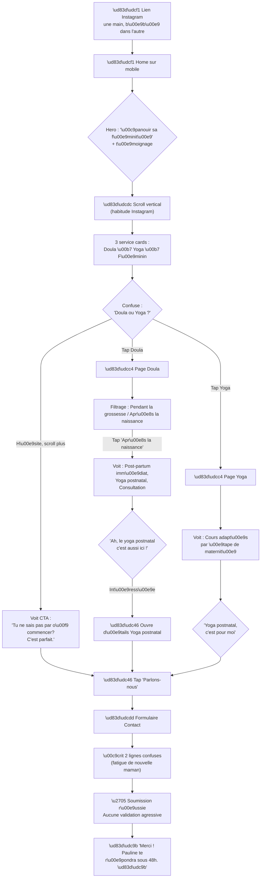
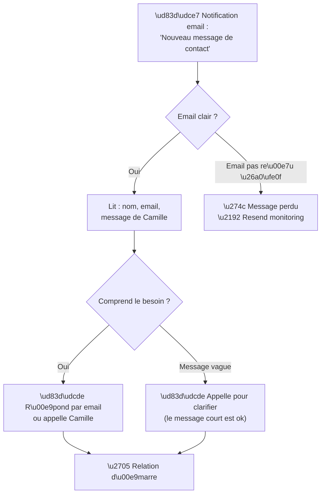

---
stepsCompleted:
  - step-01-init
  - step-02-discovery
  - step-03-core-experience
  - step-04-emotional-response
  - step-05-inspiration
  - step-06-design-system
  - step-07-defining-experience
  - step-08-visual-foundation
  - step-09-design-directions
  - step-10-user-journeys
  - step-11-component-strategy
  - step-12-ux-patterns
  - step-13-responsive-accessibility
  - step-14-complete
lastStep: 14
completedAt: "2026-02-13"
inputDocuments:
  - _bmad-output/planning-artifacts/prd.md
  - _bmad-output/planning-artifacts/prd-validation-report.md
  - docs/index.md
  - docs/project-overview.md
  - docs/architecture.md
  - docs/api-contracts.md
  - docs/data-models.md
  - docs/component-inventory.md
  - docs/source-tree-analysis.md
  - docs/development-guide.md
  - docs/deployment-guide.md
date: "2026-02-13"
---

# Spécification de design UX — shooting-star

**Auteur :** Flavius
**Date :** 2026-02-13

---

## Résumé exécutif

### Vision du projet

Shooting-star est le site vitrine professionnel de Pauline Roussel — doula et instructrice de yoga périnatal basée à Saint-Lambert (Rive-Sud de Montréal). Le site ne vend pas un produit ; il _invite à une relation_. L'accompagnement à la naissance est le service phare, et le site doit bâtir suffisamment de confiance en quelques minutes pour que la visiteuse fasse le pas de contacter Pauline.

Ce qui rend ce projet singulier : ce n'est pas un site clinique ni un catalogue froid. C'est une extension de la présence de Pauline — douce, chaleureuse, humaine. Le design doit faire _ressentir_ son soutien aux visiteuses avant même qu'elles en aient fait l'expérience.

**Type de projet :** Application web SSR (React Router v7, Tailwind v4, shadcn/ui) déployée sur Fly.io (Toronto). Brownfield — le site est déjà en production. Phase actuelle : consolidation et raffinement UX via la méthodologie BMAD.

### Utilisatrices cibles

| Persona                                      | Contexte                                               | Ce qu'elle cherche                                                              | Comment elle navigue                                                                       |
| -------------------------------------------- | ------------------------------------------------------ | ------------------------------------------------------------------------------- | ------------------------------------------------------------------------------------------ |
| **Camille** (future maman, B2C principal)    | 31 ans, enceinte de 5 mois, premier bébé, anxieuse     | Une doula qui la rassure — quelqu'un en qui elle peut _avoir confiance_         | Google « doula Montréal » ou lien Instagram → accueil → page doula → témoignages → contact |
| **Isabelle** (maman post-partum, cas limite) | 28 ans, 3 semaines post-partum, épuisée, un peu perdue | Du soutien, mais ne sait pas exactement quoi (yoga postnatal ? doula ?)         | Lien Instagram → mobile, **une main libre** (bébé dans l'autre) → explore, hésite, décide  |
| **Pauline** (propriétaire du site)           | Pas technique du tout, téléphone + Instagram           | Recevoir les demandes de contact sans en manquer, se concentrer sur son travail | Reçoit des notifications par courriel, répond par courriel/téléphone                       |

**Aisance technologique des utilisatrices :** Modérée à faible. Elles ne sont pas là pour explorer un site web — elles répondent à un besoin émotionnel et pratique.

**Appareil dominant :** Mobile, clairement. Le cas d'usage « une main tient le bébé, l'autre fait défiler » n'est pas un cas limite — c'est **le** cas d'usage central.

**Zone géographique ciblée (par priorité) :**

1. Rive-Sud — Saint-Lambert, Longueuil, Brossard, Saint-Bruno, Boucherville
2. Sud-Ouest de l'île — Verdun, Le Sud-Ouest, LaSalle, Ville-Émard
3. Centre de Montréal — Plateau, Rosemont, Villeray, Centre-ville

### Défis de design clés

#### 1. L'entonnoir de confiance (Camille → contact)

La page Doula est le cœur de l'entonnoir. Une femme enceinte arrive avec de l'anxiété et doit repartir avec le sentiment de _« c'est elle que je veux. »_ Les témoignages sont le levier de confiance critique, mais actuellement ils se trouvent en bas de la page, après un catalogue volumineux de 9 services à la carte. **Le parcours émotionnel doit précéder le catalogue rationnel.**

#### 2. Clarté des services vs confusion

Un décalage potentiel existe entre la page Yoga (organisée par format : privé / studio / entreprise) et les parcours utilisatrices du PRD (organisés par besoin : prénatal / postnatal / privé). La page Doula inclut aussi le yoga prénatal et postnatal dans ses 9 services à la carte. Une maman en post-partum comme Isabelle pourrait ne pas comprendre où aller. **La distinction entre les services de doula (accompagnement à la naissance) et le yoga (pratique corporelle) doit être limpide.**

#### 3. Navigation mobile à une main

Le PRD indique : « Design mobile-first pensé pour une main (bébé dans l'autre). » Les zones de touch de 44px sont techniquement présentes, mais l'expérience globale — la densité d'information sur la page Doula (9 cartes de services !), la longueur du scroll — mérite d'être repensée pour ce contexte réel.

### Opportunités de design

#### 1. L'émotion avant l'information

Pauline a de magnifiques témoignages (« une douceur et une écoute incroyables »). Ces mots pourraient apparaître _dans les premières secondes_ du parcours, pas après avoir scrollé 9 cartes de services. Imaginez Camille arrivant et lisant immédiatement une autre maman dire « Je me suis sentie soutenue à chaque étape » — la confiance se bâtit avant même qu'elle ne lise les détails.

#### 2. Narration visuelle (en attente de vraies images)

Les maquettes sont prêtes, les placeholders SVG sont en place — mais le site attend clairement les photos professionnelles de Pauline. Quand elles arriveront, c'est là que le site va _respirer_. Le design system est prêt à les accueillir (les composants Hero, About, FeatureBlock ont tous des emplacements pour images).

#### 3. Des CTA qui rassurent plutôt que de vendre

« Prendre rendez-vous pour un appel découverte » est déjà mieux que « Contactez-nous. » Mais le micro-copy pourrait aller plus loin pour les parcours anxieux : des indications comme « Pas sûre de ce dont tu as besoin ? Écris-moi, on en jase. » serait plus humain et pregnancy-safe.

## Expérience utilisatrice fondamentale

### Expérience définissante

L'action utilisatrice fondamentale de shooting-star est : **contacter Pauline après avoir développé un sentiment de confiance.** La soumission du formulaire de contact n'est pas l'expérience — c'est la _culmination_ d'un processus émotionnel qui commence dès l'instant où la visiteuse arrive sur le site.

Le moment décisif de succès, comme le PRD l'indique : _« Le moment où Camille lit les témoignages et l'approche de Pauline, et pense "c'est elle que je veux." Le formulaire de contact n'est que la concrétisation. »_

Tout le reste — lire les services, explorer les offres de yoga, comprendre l'approche — **sert ce moment de décision émotionnelle.**

### Stratégie de plateforme

| Aspect                       | Décision                                     | Justification                                                                                |
| ---------------------------- | -------------------------------------------- | -------------------------------------------------------------------------------------------- |
| **Plateforme**               | Web responsive, SSR (déjà en place)          | Pas d'appli mobile — le public cible cherche sur Google/Instagram, pas dans un App Store     |
| **Input dominant**           | Touch (mobile)                               | Le cas d'usage « une main » est central — bébé dans l'autre bras                             |
| **Réseau**                   | 4G variable, Québec                          | NFR-P1 : LCP < 2,5s en 4G simulé. Pas de fonctionnalités lourdes côté client                 |
| **Hors ligne**               | Pas requis                                   | Site vitrine, pas d'interactions complexes — connexion requise pour le formulaire de contact |
| **Avantage SSR**             | Indexable, premier chargement rapide         | Critique pour le SEO local (Phase 2) et la performance perçue                                |
| **Amélioration progressive** | Les formulaires fonctionnent sans JavaScript | Les server actions gèrent déjà la soumission de formulaire — le chemin sans JS existe        |

### Interactions sans effort

| Interaction                        | Ce qui doit être sans effort                                                  | État actuel                                                                                |
| ---------------------------------- | ----------------------------------------------------------------------------- | ------------------------------------------------------------------------------------------ |
| **Comprendre ce que Pauline fait** | En ≤ 30 secondes depuis l'arrivée, sans scroller plus d'un écran              | ✅ Hero + 3 cartes de services — bien, mais le hero a un bug d'espacement (« Épanouirsa ») |
| **Trouver la page Doula**          | Un tap dans le menu, sans hésitation                                          | ✅ Item « Doula » clair dans la nav                                                        |
| **Lire les témoignages**           | Visibles tôt dans l'entonnoir, pas après 9 cartes de services                 | ⚠️ Actuellement en bas de la page Doula — friction                                         |
| **Contacter Pauline**              | CTA visible en permanence, formulaire en 4 champs, soumission sans JavaScript | ✅ CTA présent sur chaque page + amélioration progressive                                  |
| **Distinguer Doula vs Yoga**       | Clair d'un coup d'œil — savoir quel service choisir selon le besoin           | ⚠️ Chevauchement : le yoga apparaît dans les services doula à la carte                     |
| **Naviguer sur mobile**            | Zones de touch 44px+, menu accessible au pouce, scroll vertical simple        | ✅ Techniquement ok, mais densité élevée sur /doula                                        |

### Moments critiques de succès

#### Succès : « C'est elle que je veux »

Quand Camille lit un témoignage et voit la photo de Pauline, elle se projette dans la relation. Elle se sent comprise. Ce moment transforme une visiteuse en cliente potentielle. **C'est LE moment à optimiser.**

#### Échec : « Je ne sais pas où aller »

Isabelle, 3 semaines post-partum, arrive depuis Instagram. Elle voit Doula et Yoga dans la nav. Elle hésite. Elle va vers Doula — et voit le yoga prénatal dans les services à la carte. Confusion. Elle ferme son téléphone. **L'orientation doit être claire même pour un cerveau fatigué.**

#### Succès : Le formulaire qui n'intimide pas

Camille tape « Prendre rendez-vous pour un appel découverte. » Elle tombe sur un formulaire simple : nom, courriel, un court message. Pas d'obligation de choisir un service spécifique, pas de menu déroulant complexe. Elle écrit 2 lignes et envoie. **Le formulaire actuel est déjà bon — le champ optionnel « disponibilité » est un choix judicieux.**

#### Échec : Le scroll infini sur mobile

La page Doula défile à travers 5 phases d'approche + 9 cartes de services + un CTA + des témoignages + un pied de page. Sur un écran de 375px, c'est beaucoup. **Une maman fatiguée qui scrolle sans trouver ce qu'elle cherche est une maman qui abandonne.**

### Principes d'expérience

#### 1. La confiance avant l'information

Commencer par faire _ressentir_ aux visiteuses avant de leur faire _comprendre_. Témoignages, ton, photo de Pauline — c'est le premier contact émotionnel. Les détails des services viennent ensuite.

#### 2. Conçu pour une seule main

Chaque interaction est mentalement testée contre le scénario : « Est-ce que je peux faire ça avec mon pouce, mon bébé dans l'autre bras, en étant épuisée ? » Si non, on simplifie.

#### 3. Clarté immédiate

Chaque page répond à UNE question d'un coup d'œil. Accueil : « Qui est Pauline ? » Doula : « Comment m'accompagne-t-elle ? » Yoga : « Quels sont ses cours ? » Pas de confusion, pas de chevauchement.

#### 4. Le contact comme invitation, pas comme vente

Le CTA n'est pas « acheter » ou « réserver. » C'est « parlons-nous. » Le micro-copy partout doit donner la permission de douter, de questionner, de ne pas savoir exactement ce qu'on veut — et que c'est correct.

## Réponse émotionnelle souhaitée

### Objectifs émotionnels primaires

Shooting-star est fondamentalement un projet de design émotionnel. Le site n'optimise pas pour la productivité ou l'efficacité — il crée un espace où des femmes vulnérables se sentent suffisamment en sécurité pour tendre la main.

| Priorité | Objectif émotionnel | Ce que ça signifie en pratique                                                                                |
| -------- | ------------------- | ------------------------------------------------------------------------------------------------------------- |
| **1**    | **Confiance**       | La visiteuse croit que Pauline est compétente, bienveillante, et la bonne personne pour elle                  |
| **2**    | **Chaleur**         | Le site donne l'impression d'une conversation avec une amie bienveillante, pas d'une brochure d'entreprise    |
| **3**    | **Permission**      | La visiteuse sent que c'est correct de ne pas savoir ce dont elle a besoin, de douter, de simplement demander |
| **4**    | **Calme**           | L'expérience apaise plutôt qu'elle ne stimule — un répit de l'anxiété                                         |
| **5**    | **Appartenance**    | La visiteuse se sent vue et comprise — « d'autres mamans comme moi sont passées par là »                      |

**Émotions à éviter activement :** Froideur clinique, pression de vente, surcharge d'information, complexité cognitive, anxiété de performance (« est-ce que j'ai bien rempli ce formulaire ? »).

### Cartographie du parcours émotionnel

#### Arc émotionnel de Camille (persona principal)

| Étape                     | Émotion à l'arrivée                                         | Émotion souhaitée au départ                                        | Ce qu'il faut éviter                                                |
| ------------------------- | ----------------------------------------------------------- | ------------------------------------------------------------------ | ------------------------------------------------------------------- |
| **Arrivée sur l'accueil** | Curiosité mêlée de scepticisme — « encore un site web ? »   | _Chaleur_ — « oh, c'est différent, c'est doux »                    | Froideur clinique ou surcharge d'information                        |
| **Page Doula**            | Intérêt — « ok, qu'est-ce qu'elle fait concrètement ? »     | _Confiance_ — « elle comprend ce que je vis »                      | Confusion (trop de choix) ou impression d'être « vendue »           |
| **Témoignages**           | Besoin de validation — « est-ce que ça en vaut la peine ? » | _Projection_ — « ces mamans sont comme moi, ça pourrait être moi » | Doute (témoignages génériques ou artificiels)                       |
| **Formulaire de contact** | Hésitation — « suis-je prête à faire ce pas ? »             | _Permission_ — « c'est juste une conversation, pas un engagement » | Pression (obligation de choisir un service, sentiment d'engagement) |
| **Après soumission**      | Petit stress — « va-t-elle répondre ? »                     | _Réassurance_ — « mon message a été reçu, elle va me contacter »   | Incertitude (pas de confirmation, page vide)                        |

#### Arc émotionnel d'Isabelle (persona cas limite)

| Étape                          | Émotion à l'arrivée                                                       | Émotion souhaitée au départ                                    | Ce qu'il faut éviter                                                 |
| ------------------------------ | ------------------------------------------------------------------------- | -------------------------------------------------------------- | -------------------------------------------------------------------- |
| **Arrivée (mobile, une main)** | Fatigue + « j'ai besoin d'aide mais je ne sais pas quoi »                 | _Bienvenue_ — « ici on ne me juge pas, on me comprend »        | Surcharge cognitive, obligation de comprendre le site pour continuer |
| **Navigation**                 | Hésitation — Doula ou Yoga ?                                              | _Guidance douce_ — « ah ok, le yoga postnatal c'est pour moi » | Confusion entre les services, sentiment de perdre son temps          |
| **Contact**                    | Fatigue + doute — « je n'ai même pas l'énergie d'écrire un long message » | _Simplicité_ — « 2 lignes suffisent, elle comprendra »         | Formulaire complexe, champs obligatoires superflus                   |

### Micro-émotions

| Paire de micro-émotions       | Contexte                                                               | Comment le design répond                                                                                |
| ----------------------------- | ---------------------------------------------------------------------- | ------------------------------------------------------------------------------------------------------- |
| **Confiance vs scepticisme**  | « Est-ce une vraie professionnelle ? »                                 | Témoignages authentiques, photo de Pauline, certifications listées, ton personnel (pas corporatif)      |
| **Calme vs anxiété**          | L'utilisatrice arrive peut-être déjà anxieuse (grossesse, post-partum) | Animations calmes, couleurs douces (palette beige/vert/menthe), rythme de lecture doux                  |
| **Appartenance vs isolement** | « D'autres mamans vivent-elles la même chose ? »                       | Témoignages qui normalisent les doutes, langage inclusif (« ton parcours unique »)                      |
| **Compétence vs confusion**   | « Est-ce que je comprends ce que je lis ? »                            | Langage simple, pas de jargon médical, une idée par section, hiérarchie visuelle claire                 |
| **Permission vs pression**    | « Est-ce que la contacter m'engage déjà ? »                            | Micro-copy rassurante (« Écris-moi, on en jase »), pas de prix affichés, pas de « réservez maintenant » |

### Implications pour le design

| Cible émotionnelle | Traduction UX                                                                                                                           | État d'implémentation                                                 |
| ------------------ | --------------------------------------------------------------------------------------------------------------------------------------- | --------------------------------------------------------------------- |
| **Chaleur**        | Palette chaude (beige `#ceaf9b`, rose pâle `#ffddd3`), typographie Ivyora Display (élégante mais pas froide), photos de Pauline à venir | Palette et typographie en place ✅                                    |
| **Calme**          | Animations subtiles (150-400ms), respect de `prefers-reduced-motion`, pas de pop-ups ni de clignotements, espacement généreux           | Patterns pregnancy-safe implémentés ✅                                |
| **Confiance**      | Témoignages positionnés tôt dans l'entonnoir, page À propos riche (bio + formations + philosophie), ton personnel                       | Le contenu existe, mais le positionnement des témoignages à revoir ⚠️ |
| **Permission**     | CTA doux (« Parlons-nous » > « Réservez maintenant »), formulaire minimal, pas de prix, pas de sélection de service obligatoire         | Formulaire simple ✅ mais micro-copy à affiner ⚠️                     |
| **Clarté**         | Une proposition de valeur par page, hiérarchie H1→H2→H3 propre, distinction claire des services                                         | Structure existante ✅ mais chevauchement doula/yoga ⚠️               |

### Principes de design émotionnel

#### 1. Le site doit respirer

Espaces blancs généreux, rythme de lecture doux. Pas de murs de texte, pas de grilles denses. Chaque section peut respirer. Cela reflète l'espace que Pauline crée pour ses clientes — sécurisant et spacieux.

#### 2. Les couleurs racontent une histoire

Vert (`#618462`) = ancrage, nature, santé. Rose (`#af6868`) = chaleur, féminité, invitation. Beige (`#ceaf9b`) = douceur, terre, maternité. Chaque couleur sert un objectif émotionnel, pas décoratif.

#### 3. Les mots comptent autant que les visuels

Le micro-copy est un outil émotionnel. « Prendre rendez-vous pour un appel découverte » → permission. « J'ai hâte de te rencontrer » (déjà présent dans le formulaire) → chaleur humaine. Chaque mot doit être pesé avec l'empathie d'une doula.

#### 4. Les erreurs doivent rassurer, pas punir

Si le formulaire échoue (limite de débit, courriel invalide), le message doit être bienveillant. Pas « Erreur 429 » — plutôt « Tu as déjà envoyé un message récemment. Pauline va te répondre bientôt. 💛 »

## Analyse de patterns UX et inspiration

### Analyse de produits inspirants

#### 1. Sites web de doulas et de praticiennes bien-être (tendances du secteur)

Les meilleurs sites de doulas partagent des caractéristiques UX frappantes :

- **Le visage en premier** — La photo de la praticienne est le _premier élément visible_. Pas un logo, pas un slogan — un visage humain. Parce que choisir une doula, c'est choisir une _personne_. La confiance commence par le regard.
- **Témoignages au-dessus de la ligne de flottaison** — Les meilleures doulas placent un témoignage directement dans ou sous le hero. Avant même que la visiteuse ne scrolle, elle lit les mots d'une autre maman.
- **Entonnoir linéaire ultra-simple** — Accueil → Services → Contact. Pas 15 pages. La visiteuse ne veut pas un catalogue — elle veut une réponse à « peux-tu m'aider ? »
- **Ton intime** — Tutoiement, première personne, phrases courtes. « Je t'accompagne » plutôt que « Nos services d'accompagnement sont conçus pour... »

Erreurs courantes dans le secteur : pages surchargées de services (le risque sur la page Doula actuelle avec 9 cartes), jargon spirituel inaccessible, pas de photos ou uniquement des photos banque d'images.

#### 2. Instagram (plateforme native du public cible)

Instagram est probablement l'outil #1 de la clientèle de Pauline — là où les mamans découvrent les doulas, partagent des recommandations, consomment du contenu périnatal.

- **Le scroll vertical est naturel** — Les utilisatrices sont habituées au flux vertical continu. Pas d'onglets complexes, pas de navigation latérale.
- **L'image est reine** — Un post Instagram sans image n'existe pas. Le site doit être aussi visuel quand les photos arriveront.
- **Les stories = contenu éphémère et intime** — Le format court, personnel, « behind the scenes » crée de l'intimité. Le site peut reproduire ça avec un ton personnel et des sections courtes.
- **Le DM comme conversion** — Sur Instagram, la conversion c'est le message direct. Le formulaire de contact doit être aussi simple qu'envoyer un DM.

#### 3. Applications de grossesse (BabyCenter, What to Expect, Grossesse+)

Ce sont des applications que Camille et Isabelle utilisent probablement au quotidien.

- **Personnalisation par étape** — L'application s'adapte à la semaine de grossesse. Shooting-star n'a pas besoin de comptes, mais l'idée de _parler au bon moment_ est transférable : la page Doula pourrait mieux guider entre « pendant la grossesse » et « après la naissance. »
- **Langage de normalisation** — « C'est parfaitement normal de se sentir ainsi cette semaine. » Le ton de Pauline fait déjà ça bien.
- **Lecture rapide, une info par écran** — Ces applications comprennent que l'utilisatrice est fatiguée. Pas de murs de texte. Des cartes courtes, un sujet par vue.

### Patterns UX transférables

#### Patterns de navigation

| Pattern                           | Source                        | Application pour shooting-star                                                                                  |
| --------------------------------- | ----------------------------- | --------------------------------------------------------------------------------------------------------------- |
| **Le visage comme ancre du hero** | Sites de doulas               | Quand les photos de Pauline seront prêtes, le hero de l'accueil devrait montrer son visage — pas juste du texte |
| **Scroll vertical simple**        | Instagram                     | Garder le flux vertical simple sur mobile. Pas d'onglets, pas de carrousels pour les services principaux        |
| **Navigation minimale**           | Bonne pratique bien-être      | 5 items max dans la nav. Actuellement 5 (Doula, Yoga, Féminin, À propos, Contact) → bien ✅                     |
| **CTA flottant sticky**           | Applications mobiles modernes | Un bouton « Contact » subtil mais toujours accessible pourrait réduire la friction sur les longues pages        |

#### Patterns d'interaction

| Pattern                            | Source                      | Application pour shooting-star                                                                                              |
| ---------------------------------- | --------------------------- | --------------------------------------------------------------------------------------------------------------------------- |
| **Témoignage dans le hero**        | Sites de doulas performants | Un court témoignage ou phrase de confiance visible dès l'arrivée, avant le scroll                                           |
| **Formulaire style DM**            | Instagram                   | Le formulaire de contact doit être aussi simple qu'écrire un DM Instagram — 2-3 champs, pas de cérémonie                    |
| **Sections courtes et scannables** | Applications de grossesse   | Chaque section = une idée. Si ça prend plus d'un écran mobile à lire, c'est trop long                                       |
| **Divulgation progressive**        | Bonne pratique UX           | Sur la page Doula : montrer l'approche (5 phases) d'abord, les 9 services à la carte ensuite, « en savoir plus » sur chacun |

#### Patterns visuels

| Pattern                            | Source                       | Application pour shooting-star                                                           |
| ---------------------------------- | ---------------------------- | ---------------------------------------------------------------------------------------- |
| **Palette chaude et tons terreux** | Tendance bien-être 2024-2026 | La palette actuelle (vert, beige, rose pâle) est exactement dans la tendance — garder ✅ |
| **Serif élégante pour les titres** | Sites bien-être premium      | Ivyora Display est parfaite — raffinée sans être prétentieuse ✅                         |
| **Espaces blancs généreux**        | Apple, Headspace             | L'espace blanc = de l'air. Les sections pourraient bénéficier d'encore plus d'espace     |
| **Coins arrondis partout**         | Tendance UI 2024-2026        | Le design system utilise déjà des coins arrondis (hero, sections) — cohérent ✅          |

### Anti-patterns à éviter

| Anti-pattern                                   | Pourquoi c'est nuisible                                                         | Risque actuel pour shooting-star                           |
| ---------------------------------------------- | ------------------------------------------------------------------------------- | ---------------------------------------------------------- |
| **Catalogue plat de services sans hiérarchie** | L'utilisatrice ne sait pas par où commencer, scrolle sans but                   | ⚠️ La page Doula avec 9 cartes égales est à risque         |
| **Pop-up d'infolettre à l'arrivée**            | Interrompt le premier contact émotionnel, agressif sur mobile                   | ✅ Pas de pop-up — bon choix                               |
| **Photos « yoga » de banque d'images**         | La visiteuse sent l'inauthenticité instantanément — destruction de la confiance | ✅ Mieux vaut des placeholders SVG que de fausses photos   |
| **Jargon spirituel impénétrable**              | Aliène 50% du public qui veut de la réassurance concrète                        | ✅ Le contenu actuel est accessible et chaleureux          |
| **Formulaire de contact avec 8+ champs**       | Effort excessif pour une utilisatrice fatiguée ou hésitante                     | ✅ Le formulaire actuel est minimal (4 champs) — excellent |
| **Prix affichés trop tôt**                     | Crée un filtre transactionnel avant que la confiance ne soit établie            | ✅ Pas de prix affichés — approche relationnelle           |

### Stratégie d'inspiration design

#### À adopter

- **Le visage humain comme point d'ancrage** — dès que les photos de Pauline sont disponibles
- **Témoignages au début de l'entonnoir** — pas en fin de page, mais dans les premières sections
- **Divulgation progressive pour les services** — aperçu d'abord, détails au clic
- **Simplicité de formulaire style DM** — garder la friction au minimum

#### À adapter

- **Scroll vertical Instagram** — pour le mobile, mais avec des repères de progression (sections visuellement distinctes)
- **Personnalisation par étape (applications de grossesse)** — pas de comptes utilisateurs, mais une guidance claire « enceinte → Doula / post-partum → Yoga postnatal »
- **CTA mobile sticky** — subtil, pas intrusif, cohérent avec le ton d'« invitation » de Pauline

#### À éviter

- **Le catalogue plat** — les 9 services doula doivent être hiérarchisés, pas listés à égalité
- **Images de banque d'images** — pas de photos banque d'images. Des placeholders honnêtes > de la malhonnêteté visuelle
- **Sur-optimisation SEO** — pas de bourrage de mots-clés ; le ton doit rester authentique et humain

## Fondation du design system

### Choix du design system

Shooting-star utilise une fondation de design system existante et mature : **Tailwind CSS v4 + shadcn/ui (variante new-york) + primitives Radix UI**, avec un thème de marque entièrement personnalisé. C'est une approche de **système thématisable** — des composants éprouvés avec une personnalisation visuelle complète.

| Couche               | Technologie                                          | Statut                                                          |
| -------------------- | ---------------------------------------------------- | --------------------------------------------------------------- |
| **Tokens de design** | Tailwind CSS v4 (thème personnalisé dans `app.css`)  | ✅ 9 couleurs de marque, 3 familles typo, breakpoints standards |
| **Primitives UI**    | shadcn/ui (new-york) + Radix UI                      | ✅ 10 composants (Button, Card, Form, Input, Select, etc.)      |
| **Variants**         | CVA (Class Variance Authority)                       | ✅ Button avec 8 variants (default, cta, service-card, etc.)    |
| **Composition**      | 23 modules de layout (Hero, Services, Contact, etc.) | ✅ Couverture complète des pages                                |
| **Documentation**    | Storybook 10 + Chromatic (régression visuelle)       | ✅ 18 fichiers de stories                                       |
| **Accessibilité**    | axe-core + ARIA + patterns pregnancy-safe            | ✅ Zones de touch 44px+, `prefers-reduced-motion`               |

### Justification du choix

Le système actuel est le bon choix pour shooting-star. Aucun changement de fondation n'est nécessaire.

| Critère                                   | Évaluation                                                                                                               |
| ----------------------------------------- | ------------------------------------------------------------------------------------------------------------------------ |
| **Cohérence visuelle**                    | shadcn/ui + Tailwind fournit une base uniforme. Les composants partagent le même langage visuel ✅                       |
| **Accessibilité native**                  | Les primitives Radix UI = accessible par défaut (gestion du focus, ARIA, navigation clavier) ✅                          |
| **Performance**                           | Tailwind purge les classes inutilisées, pas de runtime CSS, bundle léger ✅                                              |
| **Maintenabilité (dev solo + agents IA)** | shadcn/ui = code copié dans le projet, aucune dépendance externe à gérer ✅                                              |
| **Personnalisation**                      | Le thème Tailwind est entièrement personnalisé (couleurs, typographie, patterns) — la marque de Pauline est respectée ✅ |
| **Pregnancy-safe**                        | Les patterns d'animation, zones de touch et reduced-motion sont déjà intégrés ✅                                         |

### Approche d'implémentation

La stratégie est **évolutive, pas révolutionnaire :**

1. **Phase actuelle (consolidation)** — Auditer les composants existants, s'assurer qu'ils sont utilisés à leur plein potentiel (espacement, variants)
2. **Quand les photos arrivent** — Optimiser les composants Hero, About, FeatureBlock pour de vraies images (formats, dimensions, chargement paresseux)
3. **Post-consolidation** — Ajouter les variants manquantes (témoignage vedette, directives de micro-copy) via les stories Storybook

### Stratégie de personnalisation

#### Tokens — Conserver

- **Palette de couleurs :** 9 couleurs, chacune servant un objectif émotionnel clair (vert=ancrage, rose=chaleur, beige=douceur)
- **Typographie :** Ivyora Display (titres), Barlow (corps), Moontime (accents décoratifs)
- **Pas de nouveaux tokens nécessaires** — le système existant est complet

#### Composants — Affiner

| Aspect                       | Approche                                                                                                               | Priorité      |
| ---------------------------- | ---------------------------------------------------------------------------------------------------------------------- | ------------- |
| **Préréglages d'espacement** | Auditer l'usage — favoriser le défaut `spacious` pour de l'espace de respiration                                       | Affinement ⚠️ |
| **TestimonialCard**          | Ajouter une variante « featured » — plus grande, citation en Ivyora Display, positionnable dans les premières sections | Évolution 🆕  |
| **Micro-copy des CTA**       | Documenter les directives dans Storybook — quel texte pour quel contexte                                               | Évolution 🆕  |
| **Feedback de formulaire**   | Intégrer des messages d'erreur/succès pregnancy-safe comme tokens du design system                                     | Évolution 🆕  |
| **Animations (Issue #186)**  | Ajouter des effets subtils de scroll, hover et transition dans le cadre pregnancy-safe                                 | Évolution 🆕  |

#### Composants — Aucun changement nécessaire

- **10 primitives UI** — complets, bien implémentés
- **23 modules de layout** — couvrent toutes les pages actuelles et prévues
- **Aucun nouveau composant primitif requis**

## 2. Core User Experience

### 2.1 Defining Experience

> **« Lire les mots d'une autre maman et sentir que c'est possible pour moi aussi — puis écrire à Pauline comme on écrit à une amie. »**

Chaque produit à succès a une interaction fondatrice :

- **Tinder :** "Swipe pour matcher"
- **Spotify :** "Écouter n'importe quelle chanson instantanément"
- **Shooting-star :** _"Lire un témoignage, sentir la confiance monter, et écrire à Pauline sans pression"_

Ce n'est pas le formulaire de contact en lui-même qui est l'expérience fondatrice. C'est la **séquence émotionnelle** qui y mène :

1. **Voir le visage de Pauline** (connexion humaine)
2. **Lire les mots d'une autre maman** (projection — "elle est comme moi")
3. **Sentir la permission** (micro-copy rassurant — "just a conversation")
4. **Écrire 2 lignes** (aussi simple qu'un DM Instagram)

Si on réussit cette séquence parfaitement, tout le reste (pages services, yoga, féminin sacré) devient du contexte de soutien, pas le cœur de l'expérience.

**Ce que les utilisatrices diraient à une amie :** _"J'ai trouvé une doula trop bien — j'ai vu des témoignages sur son site et je lui ai écrit direct, c'était super simple."_

### 2.2 User Mental Model

**Comment les utilisatrices résolvent ce problème aujourd'hui :**

| Méthode actuelle     | Ce qu'elles aiment                         | Ce qu'elles détestent                                                        |
| -------------------- | ------------------------------------------ | ---------------------------------------------------------------------------- |
| **Bouche-à-oreille** | La confiance est pré-établie               | Pas toujours disponible — "personne dans mon entourage n'a eu de doula"      |
| **Recherche Google** | Exhaustif                                  | Trop de choix, sites cliniques ou froids, impossible de "sentir" la personne |
| **Instagram**        | Authentique, intime, on "voit" la personne | Éparpillé, pas structuré, difficile de trouver les infos pratiques           |
| **Annuaires doulas** | Comparaison facile                         | Pas d'émotion — fiches techniques sans chaleur humaine                       |

**Modèle mental apporté par la visiteuse :**

- Elle ne cherche pas un "service" — elle cherche une **personne** en qui avoir confiance
- Elle s'attend à ce que le site fonctionne comme un prolongement de ce qu'elle a vu sur Instagram — personnel, chaleureux, simple
- Elle a l'habitude du scroll vertical (Instagram, TikTok) et de la conversion par message direct
- Elle ne veut pas choisir un service spécifique avant de contacter — elle veut d'abord savoir si "c'est la bonne personne"

**Où elle risque d'être perdue :**

- Trop de services présentés au même niveau (9 cartes doula)
- Confusion entre Doula et Yoga (le yoga apparaît dans les deux)
- Témoignages trop bas dans la page (elle a déjà décidé avant d'y arriver — ou pire, elle est partie)

### 2.3 Success Criteria

**L'interaction fondatrice est réussie quand :**

| Critère de succès        | Indicateur mesurable                                             | Seuil cible                                          |
| ------------------------ | ---------------------------------------------------------------- | ---------------------------------------------------- |
| **"This just works"**    | Temps entre l'arrivée sur la page et la soumission du formulaire | < 4 minutes (pour un parcours motivé)                |
| **"She's the one"**      | Nombre de témoignages lus avant le premier contact               | ≥ 1 témoignage visible sans scroll actif (hero zone) |
| **"So easy"**            | Nombre de champs remplis pour contacter                          | ≤ 4 champs (actuellement 4 ✅)                       |
| **"I feel safe"**        | Taux d'abandon du formulaire de contact                          | < 30% (parcours de confiance complet)                |
| **"I know where to go"** | Temps de navigation vers le formulaire de contact                | ≤ 2 taps depuis n'importe quelle page                |

**Feedback de réussite :**

- La visiteuse se sent _intelligente_, pas _perdue_ — la navigation est évidente
- Le formulaire de confirmation la rassure immédiatement ("Pauline te répondra sous 48h 💛")
- L'absence de prix affichés supprime le stress transactionnel

**Ce qui doit se passer automatiquement :**

- Le CTA de contact est _toujours_ visible ou accessible (sticky ou récurrent)
- Les témoignages apparaissent _tôt_ dans le funnel (pas après 9 blocs de services)
- Le ton bascule naturellement de l'informatif au personnel au fil du scroll

### 2.4 Novel UX Patterns

**Analyse des patterns : Établis, avec une touche unique**

Shooting-star ne nécessite **pas** d'innovation UX radicale. L'interaction fondatrice (lire → faire confiance → contacter) repose sur des patterns éprouvés. Ce qui la rend unique, c'est la **calibration émotionnelle**.

| Pattern                        | Type                      | Application                                                                                   |
| ------------------------------ | ------------------------- | --------------------------------------------------------------------------------------------- |
| **Vertical scroll**            | Établi (Instagram)        | Le parcours linéaire est familier — pas de courbe d'apprentissage                             |
| **Formulaire minimal**         | Établi (UX best practice) | 4 champs, pas de sélection de service obligatoire — c'est déjà excellent                      |
| **Témoignages sociaux**        | Établi (e-commerce, SaaS) | Mais repositionnés : en haut du funnel, pas en bas                                            |
| **Progressive disclosure**     | Établi (UX best practice) | Pour les 9 services doula : aperçu d'abord, détails sur demande                               |
| **CTA récurrent (non-sticky)** | Semi-novel                | Un CTA "invitation" positionné à chaque checkpoint émotionnel, pas un bouton collant intrusif |

**Notre twist unique :**

Le site ne vend pas — il _invite_. Cela transforme tous les patterns établis par un filtre émotionnel :

- Les témoignages ne sont pas de la "preuve sociale" (marketing) — ils sont de la **normalisation** ("c'est ok de ressentir ça")
- Le formulaire n'est pas un "lead form" — c'est un **premier pas dans une relation**
- Le CTA n'est pas "acheter" — c'est "parlons-nous"

Aucun pattern novel à enseigner. Mais **chaque pattern familier est adouci** par le filtre de la permission et de la chaleur.

### 2.5 Experience Mechanics

**Mécaniques détaillées de l'interaction fondatrice :**

#### 1. Initiation — "Découvrir Pauline"

| Phase                     | Détail                                                                            | Responsabilité design             |
| ------------------------- | --------------------------------------------------------------------------------- | --------------------------------- |
| **Trigger**               | La visiteuse arrive depuis Google, Instagram, ou un lien partagé                  | SEO (Phase 2), présence Instagram |
| **Premier contact**       | Hero : visage de Pauline (quand photos dispo) + tagline claire + témoignage-ancre | Hero component                    |
| **Invitation à explorer** | Les 3 service cards orientent sans imposer un choix                               | ServiceCard + hierarchy           |

#### 2. Interaction — "Construire la confiance"

| Phase                          | Détail                                                                                                 | Responsabilité design              |
| ------------------------------ | ------------------------------------------------------------------------------------------------------ | ---------------------------------- |
| **Navigation**                 | Max 2 taps pour arriver au formulaire                                                                  | Navigation + CTA placement         |
| **Lecture**                    | Sections courtes, un message par écran mobile, scroll vertical fluide                                  | Layout modules + spacing           |
| **Découverte des témoignages** | Positionnés visiblement sur les pages Doula et Home — pas après 9 blocs de services                    | TestimonialCard + page layout      |
| **Interaction active**         | La seule interaction "engageante" demandée est le scroll. Pas de click obligatoire avant le formulaire | Progressive disclosure optionnelle |

#### 3. Feedback — "Savoir que ça a fonctionné"

| Phase                      | Détail                                                                                           | Responsabilité design        |
| -------------------------- | ------------------------------------------------------------------------------------------------ | ---------------------------- |
| **Micro-indices**          | Ton personnel dans le texte ("je", "tu"), transitions douces entre sections                      | Content strategy + animation |
| **Validation implicite**   | Chaque témoignage confirme : "d'autres mamans ont fait ce même parcours et sont heureuses"       | TestimonialCard placement    |
| **Feedback d'erreur**      | Aimable, pas punitif. "Hmm, vérifie ton courriel — je veux m'assurer de pouvoir te répondre 😊"  | Form feedback tokens         |
| **Feedback de soumission** | Message chaleureux immédiat : "Merci ! Pauline te répondra sous 48h. 💛" + email de confirmation | Toast + email system         |

#### 4. Completion — "L'après"

| Phase                     | Détail                                                                                                       | Responsabilité design |
| ------------------------- | ------------------------------------------------------------------------------------------------------------ | --------------------- |
| **Confirmation visuelle** | Message inline (pas de redirection) — la visiteuse reste dans l'ambiance rassurante du site                  | Contact form UX       |
| **Email de suivi**        | Email de confirmation déjà implémenté (`contact-confirmation.tsx`) — ton cohérent                            | Email system ✅       |
| **Next step implicite**   | La visiteuse sait que Pauline va la recontacter — elle peut continuer à explorer le site si elle le souhaite | No forced redirect    |
| **Pas de pression**       | Pas de "en attendant, suivez-nous sur Instagram" ou "abonnez-vous." Juste : c'est fait, Pauline arrive       | Content strategy      |

## Visual Design Foundation

### Color System

Le système de couleurs de shooting-star est complet et intentionnel. Chaque couleur porte une fonction émotionnelle précise, pas seulement décorative.

#### Couleurs de marque (Brand Palette)

| Token           | Hex              | Rôle émotionnel                    | Usage principal                                           |
| --------------- | ---------------- | ---------------------------------- | --------------------------------------------------------- |
| **`primary`**   | `#618462` (Vert) | Ancrage, nature, santé, confiance  | CTA principaux, accents de navigation, icônes de services |
| **`accent`**    | `#af6868` (Rose) | Chaleur, féminité, invitation      | CTA secondaires, liens, hover states, surbrillance        |
| **`secondary`** | `#517982` (Bleu) | Calme, sérénité, professionnalisme | Éléments informatifs, badges, liens discrets              |
| **`neutral`**   | `#5e4530` (Brun) | Terre, authenticité, lisibilité    | Texte principal, headings, éléments de structure          |

#### Couleurs de support (Backgrounds & surfaces)

| Token        | Hex                    | Rôle                        | Usage principal                                        |
| ------------ | ---------------------- | --------------------------- | ------------------------------------------------------ |
| **`warm`**   | `#ceaf9b` (Beige)      | Douceur, maternité, confort | Sections alternées, cards, hero backgrounds            |
| **`soft`**   | `#ffddd3` (Rose pâle)  | Tendresse, accueil          | Sections d'accent, notifications de succès, highlights |
| **`cool`**   | `#dae6ea` (Bleu pâle)  | Fraîcheur, apaisement       | Sections informatives, fonds de formulaire             |
| **`menthe`** | `#d4e8d4` (Menthe)     | Apaisement, renouveau       | Sections postnatal/bien-être, confirmations            |
| **`gris`**   | `#f5f4f2` (Gris chaud) | Neutre sans froideur        | Fonds par défaut, patterns de texture                  |
| **`white`**  | `#ffffff`              | Espace, respiration         | Fonds principaux, zones de lecture                     |

#### Associations émotionnelles par page

| Page              | Couleur dominante    | Justification                                     |
| ----------------- | -------------------- | ------------------------------------------------- |
| **Home**          | `warm` + `primary`   | Premier contact chaleureux + ancrage de confiance |
| **Doula**         | `soft` + `primary`   | Douceur de l'accompagnement + professionnalisme   |
| **Yoga**          | `menthe` + `primary` | Bien-être physique, renouveau, nature             |
| **Féminin Sacré** | `soft` + `accent`    | Féminité, intimité, chaleur                       |
| **À propos**      | `warm` + `neutral`   | Authenticité, terre-à-terre, humain               |
| **Contact**       | `cool` + `primary`   | Calme + invitation à l'action                     |

#### Accessibilité des contrastes

| Combinaison                              | Ratio estimé | WCAG AA          | Usage                                             |
| ---------------------------------------- | ------------ | ---------------- | ------------------------------------------------- |
| `neutral` (#5e4530) sur `white` (#fff)   | ~7.5:1       | ✅ AAA           | Texte principal                                   |
| `neutral` (#5e4530) sur `gris` (#f5f4f2) | ~6.8:1       | ✅ AAA           | Texte sur fond gris                               |
| `neutral` (#5e4530) sur `warm` (#ceaf9b) | ~3.1:1       | ⚠️ AA large only | Texte sur beige — utiliser semi-bold ou 18px+     |
| `primary` (#618462) sur `white` (#fff)   | ~4.0:1       | ✅ AA (normal)   | Boutons, liens                                    |
| `accent` (#af6868) sur `white` (#fff)    | ~3.6:1       | ⚠️ AA large only | Liens roses — réserver aux tailles ≥ 18px ou bold |
| `white` (#fff) sur `primary` (#618462)   | ~4.0:1       | ✅ AA            | Texte blanc sur bouton vert                       |

**Actions requises :**

- Texte sur fond `warm` (beige) : utiliser `neutral` en semi-bold (600) ou augmenter la taille à 18px+
- Texte `accent` (rose) : ne jamais utiliser en body text normal (14-16px) — uniquement en headings, CTAs ou bold
- Texte `secondary` (bleu) sur fonds clairs : vérifier le ratio au cas par cas

### Typography System

#### Font Stack

| Rôle                   | Font           | Poids                                                | Caractère émotionnel                                                                                                                                                          |
| ---------------------- | -------------- | ---------------------------------------------------- | ----------------------------------------------------------------------------------------------------------------------------------------------------------------------------- |
| **Headings**           | Ivyora Display | Light (300), Regular (400), Medium (500), Bold (700) | Élégante, raffinée sans être froide. Serif avec caractère — évoque la douceur et le professionnalisme.                                                                        |
| **Body**               | Barlow         | Regular (400), SemiBold (600)                        | Sans-serif humaniste, excellente lisibilité. Chaleureuse sans être informelle. Idéale pour du texte long sur mobile.                                                          |
| **Accents décoratifs** | Moontime       | Regular (400)                                        | Script manuscrit — utilisé avec parcimonie pour les touches personnelles (quotes, signatures, mots-clés émotionnels). _Danger : illisible en petite taille ou en paragraphe._ |
| **Sous-titres**        | Barlow         | SemiBold (600)                                       | Même famille que le body pour cohérence, mais plus affirmé.                                                                                                                   |

#### Type Scale

| Niveau         | Mobile  | Desktop | Font           | Poids          | Usage                                             |
| -------------- | ------- | ------- | -------------- | -------------- | ------------------------------------------------- |
| **Display**    | 36-40px | 48-56px | Ivyora Display | Light (300)    | Hero headlines — maximum 1 par page               |
| **H1**         | 28-32px | 36-40px | Ivyora Display | Regular (400)  | Titre de page                                     |
| **H2**         | 22-24px | 28-32px | Ivyora Display | Medium (500)   | Titre de section                                  |
| **H3**         | 18-20px | 22-24px | Barlow         | SemiBold (600) | Sous-section, card title                          |
| **Body**       | 16px    | 16-18px | Barlow         | Regular (400)  | Texte courant — minimum 16px mobile               |
| **Body large** | 18px    | 20px    | Barlow         | Regular (400)  | Lead paragraph, introduction de section           |
| **Small**      | 14px    | 14px    | Barlow         | Regular (400)  | Captions, metadata — jamais en corps de texte     |
| **Accent**     | 24-32px | 32-48px | Moontime       | Regular (400)  | Citations courtes, mots décoratifs (max 3-4 mots) |

#### Règles typographiques

1. **Moontime est un condiment, pas un plat** — Maximum 3-4 mots par occurrence. Jamais en paragraphe, jamais en navigation, jamais en label de formulaire.
2. **Ivyora Display Light pour les grands titres** — Le poids Light (300) est le plus élégant en grande taille. Réserver Medium/Bold pour les tailles ≤ 24px.
3. **Line height généreuse** — Body text en `1.6-1.75` pour un rythme de lecture doux. Headings en `1.2-1.3`. La lecture doit être _facile_, pas dense.
4. **Pas de tout-majuscules long** — Maximum 2-3 mots en uppercase (navigation items OK, paragraphes JAMAIS).

#### Font Loading Strategy

| Aspect                 | Implémentation actuelle                         | Statut                                                                              |
| ---------------------- | ----------------------------------------------- | ----------------------------------------------------------------------------------- |
| `font-display: swap`   | ✅ Sur toutes les `@font-face`                  | Correct — évite le FOIT                                                             |
| Formats modernes       | ✅ `woff2` + fallback (`ttf` ou `woff`)         | Correct — `woff2` prioritaire                                                       |
| Preload critical fonts | À vérifier                                      | Recommandation : `<link rel="preload">` pour Barlow Regular et Ivyora Display Light |
| Fallback system fonts  | ✅ Stack `ui-sans-serif, system-ui, sans-serif` | Correct — layout shift minimal                                                      |

### Spacing & Layout Foundation

#### Philosophie de l'espacement

> **Le site doit respirer** — c'est le Principe Émotionnel #1.

L'espacement n'est pas cosmétique — il communique la **sécurité**. Des espaces généreux disent à la visiteuse : "Ici, on ne te presse pas. Prends ton temps." C'est exactement ce que Pauline fait dans son accompagnement.

#### Système d'espacement

| Token   | Valeur | Usage                                                        |
| ------- | ------ | ------------------------------------------------------------ |
| **xs**  | 4px    | Espacement interne minimal (entre icône et texte)            |
| **sm**  | 8px    | Padding interne de petits éléments                           |
| **md**  | 16px   | Espacement standard (entre éléments d'un même groupe)        |
| **lg**  | 24px   | Espacement entre sections internes d'une carte               |
| **xl**  | 32px   | Espacement entre cartes / éléments de même niveau            |
| **2xl** | 48px   | Séparation entre sections de page (mobile)                   |
| **3xl** | 64px   | Séparation entre sections de page (desktop)                  |
| **4xl** | 96px   | Grandes respirations — entre blocs majeurs (hero → services) |

**Règle d'or : En cas de doute, plus d'espace.** Mieux vaut un site qui "respire trop" qu'une page dense qui étouffe.

#### Layout Grid

| Breakpoint              | Colonnes                | Gouttière | Marges latérales | Usage principal                                |
| ----------------------- | ----------------------- | --------- | ---------------- | ---------------------------------------------- |
| **Mobile** (< 640px)    | 1 col                   | —         | 16-24px          | Scroll vertical linéaire, un contenu par écran |
| **Tablet** (640-1023px) | 2 cols                  | 24px      | 32px             | Cards côte à côte, grille de services          |
| **Desktop** (≥ 1024px)  | 3-4 cols                | 32px      | 48-64px          | Layout full, sidebar possible pour navigation  |
| **Wide** (≥ 1280px)     | max-width 1200px centré | 32px      | auto             | Contenu contenu, pas d'étirement excessif      |

#### Layout Principles

1. **Un message par écran mobile** — Chaque section doit occuper approximativement un écran mobile (viewport ~667px). Si c'est plus long, découper.
2. **Hierarchy par l'espace, pas par les bordures** — Utiliser l'espacement plutôt que des lignes/boîtes pour séparer les contenus.
3. **Zones de respiration entre les sections** — Minimum 48px (mobile) / 64px (desktop) entre les sections majeures.
4. **Touch targets : 44px minimum** — Tous les éléments interactifs ont une zone de touch d'au moins 44×44px. Déjà respecté ✅.
5. **Content width ≤ 65ch pour le body text** — Les lignes de texte ne dépassent jamais ~65 caractères pour une lisibilité optimale.

#### Section Rhythm

| Section type         | Espace avant    | Espace après | Background                              |
| -------------------- | --------------- | ------------ | --------------------------------------- |
| **Hero**             | 0 (plein écran) | 4xl (96px)   | Couleur de page dominante               |
| **Section standard** | 3xl (64px)      | 3xl (64px)   | Alternance `white` / couleur de support |
| **Section CTA**      | 2xl (48px)      | 2xl (48px)   | Couleur d'accent douce                  |
| **Testimonials**     | 3xl (64px)      | 3xl (64px)   | Fond distinct (beige ou menthe)         |
| **Footer**           | 4xl (96px)      | 0            | `neutral` ou `primary` foncé            |

### Accessibility Considerations

#### Contraste et lisibilité

| Exigence                | Standard    | Statut                          | Action                                             |
| ----------------------- | ----------- | ------------------------------- | -------------------------------------------------- |
| Texte normal ≥ 4.5:1    | WCAG AA     | ✅ `neutral` sur `white`/`gris` | Maintenir                                          |
| Texte large ≥ 3:1       | WCAG AA     | ✅ toutes les combinaisons      | Maintenir                                          |
| `accent` sur fond clair | ⚠️ 3.6:1    | AA large only                   | Réserver aux titres / bold / ≥ 18px                |
| Texte sur fond `warm`   | ⚠️ ~3.1:1   | AA large only                   | Utiliser `neutral` bold ou taille ≥ 18px           |
| Focus indicators        | WCAG 2.1 AA | À vérifier                      | Ring visible 2px `primary` sur tous les focusables |

#### Mouvement et animation

| Principe                                | Implémentation                                   |
| --------------------------------------- | ------------------------------------------------ |
| `prefers-reduced-motion`                | ✅ Respecté — animations désactivées ou réduites |
| Animations max 400ms                    | ✅ Framework pregnancy-safe en place             |
| Pas de clignotement                     | ✅ Aucun élément clignotant                      |
| Scroll fluide, pas de parallax agressif | ✅ Scroll natif vertical                         |

#### Typographie accessible

| Principe                             | Implémentation                |
| ------------------------------------ | ----------------------------- |
| Taille minimale body 16px            | ✅ Standard Barlow            |
| Line height ≥ 1.5 pour body          | Recommandé 1.6-1.75           |
| Pas de texte en image                | ✅ Tout est HTML              |
| Moontime lisible uniquement en grand | ✅ Réservé aux accents ≥ 24px |
| `font-display: swap`                 | ✅ Sur toutes les @font-face  |

## Design Direction Decision

### Design Directions Explored

Quatre directions visuelles ont été explorées via un showcase HTML interactif (`_bmad-output/planning-artifacts/ux-design-directions.html`), chacune résolvant les enjeux UX identifiés avec des approches différentes :

| Direction                 | Concept                                                                                                                                 | Forces                                                                              | Contrainte                                                          |
| ------------------------- | --------------------------------------------------------------------------------------------------------------------------------------- | ----------------------------------------------------------------------------------- | ------------------------------------------------------------------- |
| **A · Confiance d'abord** | Témoignage ancré dans le hero, progressive disclosure (accordéon) pour les 9 services doula, CTA récurrents aux checkpoints émotionnels | Implémentable immédiatement, proche du code existant, confiance dès la 1ère seconde | Ne résout pas totalement la confusion Doula/Yoga                    |
| **B · Parcours guidé**    | « Où en es-tu ? » (enceinte / post-partum / curieuse) remplace la navigation par service. Filtrage des services par étape de vie        | Résout la confusion Doula/Yoga frontalement, empathique, personnalisation légère    | Plus de travail de développement, change la structure de navigation |
| **C · Face-à-face**       | Photo de Pauline en hero full, services en liste épurée, formulaire de contact style DM Instagram                                       | Impact émotionnel maximal, ultra-Instagram-native, formulaire humanisé              | **Dépend des photos professionnelles** (pas encore disponibles)     |
| **D · Respiration**       | White space maximal, un message par écran mobile, Ivyora Display Light, rythme de lecture comme une respiration de yoga                 | Principe émotionnel #1 poussé au maximum, élégance                                  | Ne résout pas activement les problèmes structurels                  |

### Chosen Direction

**Direction A comme base** — enrichie d'éléments de B et D, avec C en phase 2.

| Source          | Élément retenu                                           | Pourquoi                                                          |
| --------------- | -------------------------------------------------------- | ----------------------------------------------------------------- |
| **A (base)**    | Témoignage dans le hero                                  | Confiance immédiate — la voix d'une maman avant tout argumentaire |
| **A (base)**    | Progressive disclosure pour les services doula           | Réduit la densité de 70% sur mobile                               |
| **A (base)**    | CTA récurrents aux checkpoints émotionnels               | Invitation accessible sans être intrusive                         |
| **B**           | CTA « Tu ne sais pas par où commencer ? C'est parfait. » | Permission explicite — principe émotionnel #3                     |
| **B**           | Filtrage grossesse / post-partum sur la page Doula       | Résout la confusion des 9 services                                |
| **D**           | Espacement 4xl (96px) entre sections majeures            | Le site respire comme on respire en yoga                          |
| **D**           | Ivyora Display Light (300) pour les display titles       | Élégance subtile et premium                                       |
| **C (Phase 2)** | Photo-first hero + mini-profil sur contact               | Quand les photos professionnelles arriveront                      |

### Design Rationale

La direction hybride A+B+D a été choisie pour maximiser l'impact émotionnel immédiat tout en restant proche du code existant.

**Pourquoi A comme base :**

- Le témoignage dans le hero est la décision UX la plus impactante et la plus simple à implémenter. Elle transforme le premier contact de « voici mes services » en « voici ce qu'une maman comme toi a vécu. »
- La progressive disclosure (accordéon) résout le problème de densité de la page Doula (9 cartes → liste compacte) sans changer l'architecture.
- Les CTA récurrents positionnent le contact aux moments de décision naturels, pas en fin de page.

**Pourquoi ajouter B :**

- Le message « Tu ne sais pas par où commencer ? C'est parfait » est l'incarnation directe du principe de Permission. C'est une phrase qui change tout le ton du site.
- Le filtrage grossesse/post-partum sur la page Doula résout le problème que la direction A ne résout pas seule.

**Pourquoi ajouter D :**

- L'espacement 4xl entre sections est un changement CSS simple mais à fort impact émotionnel.
- Ivyora Display Light (300) pour les display titles apporte une élégance premium sans effort de développement.

**Pourquoi C en Phase 2 :**

- La direction C est la plus émotionnellement puissante, mais elle dépend de photos professionnelles qui ne sont pas encore disponibles. Mieux vaut l'intégrer quand le matériel visuel sera prêt.

### Implementation Approach

| Phase                    | Éléments                                                                                                                    | Effort estimé                     | Dépendance                        |
| ------------------------ | --------------------------------------------------------------------------------------------------------------------------- | --------------------------------- | --------------------------------- |
| **Phase 1 (maintenant)** | Témoignage dans hero, progressive disclosure Doula, espacement 4xl, Ivyora Light, CTA récurrents, micro-copy « permission » | Modification composants existants | Aucune                            |
| **Phase 2 (photos)**     | Photo-first hero (C), mini-profil contact (C), optimisation images                                                          | Nouveaux composants Hero variant  | Photos de Pauline                 |
| **Phase 3 (évolution)**  | Wayfinding « Où en es-tu ? » (B), filtrage services complet                                                                 | Nouveau composant + logique       | Validation par tests utilisateurs |

## User Journey Flows

### Journey 1 : Camille — « Je cherche une doula » (Happy path)

**Contexte :** Camille google « doula Montréal » ou reçoit un lien Instagram d'une amie. Enceinte de 5 mois, premier bébé, un peu anxieuse.

```mermaid
flowchart TD
    A["\ud83d\udd0d Google 'doula Montr\u00e9al'\nor lien Instagram"] --> B["\ud83d\udcf1 Arrive sur Home"]
    B --> C{"Premier contact :\nHero + t\u00e9moignage ancr\u00e9"}
    C -->|"'oh, c'est doux'"| D["\ud83d\udcd6 Lit le t\u00e9moignage dans le hero"]
    D --> E{"Intrigu\u00e9e ?"}
    E -->|Oui| F["\ud83d\udc46 Tap 'Doula' dans nav"]
    E -->|"Pas encore"| G["\ud83d\udcdc Scroll \u2192 voit les 3 service cards"]
    G --> F
    F --> H["\ud83d\udcc4 Page Doula : Hero + T\u00e9moignage t\u00f4t"]
    H --> I["\ud83d\udcd6 Lit l'approche (5 phases)"]
    I --> J{"Confiance en construction"}
    J --> K["\ud83d\udccb Services \u00e0 la carte\n(progressive disclosure)"]
    K --> L{"Besoin sp\u00e9cifique ?"}
    L -->|"Oui"| M["\ud83d\udc46 Ouvre l'accord\u00e9on\ndu service pertinent"]
    L -->|"Non, elle est convaincue"| N["\ud83d\udcd6 Lit les t\u00e9moignages"]
    M --> N
    N --> O{"'C'est elle que je veux'"}
    O -->|"Oui \u2728"| P["\ud83d\udc46 Tap CTA 'Parlons-nous'"]
    O -->|"V\u00e9rifie d'abord"| Q["\ud83d\udc46 Tap '\u00c0 propos'"]
    Q --> R["\ud83d\udcc4 Lit bio + formations + phi"]
    R --> P
    P --> S["\ud83d\udcdd Formulaire Contact :\n4 champs simples"]
    S --> T["\u2705 Soumission"]
    T --> U["\ud83d\udc9b Message de confirmation inline\n'Pauline te r\u00e9pondra sous 48h'"]
    U --> V["\ud83d\udce7 Email de confirmation automatique"]
    V --> W["\ud83d\udce7 Pauline re\u00e7oit la notification"]
    W --> X["\ud83d\udcde Pauline r\u00e9pond par email/tel"]
```

**Points chauds (émotionnels) :**

| Moment                         | Émotion cible                     | Design response                                              |
| ------------------------------ | --------------------------------- | ------------------------------------------------------------ |
| **Hero + témoignage**          | Curiosité → chaleur               | Témoignage ancré (Direction A), Ivyora Display Light         |
| **Lecture de l'approche**      | Intérêt → « elle comprend »       | Approche en 5 phases, visualisation linéaire                 |
| **Témoignages Doula**          | Besoin de validation → projection | TestimonialCard positionnée AVANT les services à la carte    |
| **« C'est elle que je veux »** | Moment décisif                    | CTA récurrent visible — « Parlons-nous »                     |
| **Formulaire**                 | Hésitation → facilité             | 4 champs, micro-copy rassurante, pas de sélection de service |
| **Confirmation**               | Petit stress → soulagement        | Message inline chaleureux + email automatique                |

**Temps cible :** < 4 minutes de l'arrivée à la soumission du formulaire.

### Journey 2 : Isabelle — « J'ai besoin d'aide mais je ne sais pas quoi » (Edge case)

**Contexte :** Isabelle, 3 semaines post-partum, bébé dans un bras, téléphone dans l'autre. Arrive depuis Instagram. Fatiguée. Ne sait pas si elle a besoin de yoga, d'une doula, ou d'autre chose.

**Points chauds spécifiques à Isabelle :**

| Moment                         | Émotion cible                            | Design response                                                       |
| ------------------------------ | ---------------------------------------- | --------------------------------------------------------------------- |
| **Confusion Doula/Yoga**       | Hésitation → guidance                    | Le CTA « Tu ne sais pas ? C'est parfait » rattrape les perdues        |
| **Filtrage post-partum**       | « Ça ne me concerne pas » → « ah, si ! » | Toggle grossesse/post-partum filtre les services pertinents           |
| **Formulaire : message court** | Fatigue → « c'est assez ? »              | Pas de minimum de caractères, micro-copy : « Dis-moi ce qui t'amène » |
| **Navigation one-handed**      | Effort physique                          | Scroll vertical pur, touch targets 48px, pas de geste complexe        |

**Scénario d'échec évité :** Isabelle arrive, voit « Doula » et « Yoga », ne sait pas, hésite, ferme son téléphone. ➡ Le CTA « Tu ne sais pas ? C'est parfait » la rattrape **avant** qu'elle ne parte.

### Journey 3 : Pauline — « J'ai reçu un nouveau message » (Admin)

**Contexte :** Pauline consulte ses emails. Pas technique. Veut juste savoir si quelqu'un l'a contactée.

**Exigences critiques pour Pauline :**

| Exigence                          | Implémentation                          | Statut                     |
| --------------------------------- | --------------------------------------- | -------------------------- |
| Notification email fiable         | Resend (email service)                  | ✅ Implémenté              |
| Email clair avec toutes les infos | Template `contact-notification.tsx`     | ✅ Implémenté              |
| Pas d'interface admin             | Modifications via Flavius + `app/data/` | ✅ Acceptable pour Phase 1 |
| Email de confirmation au visiteur | Template `contact-confirmation.tsx`     | ✅ Implémenté              |

### Journey Patterns

**Patterns récurrents extraits des 3 journeys :**

| Pattern                          | Occurrences                                                 | Implémentation                                                                 |
| -------------------------------- | ----------------------------------------------------------- | ------------------------------------------------------------------------------ |
| **Scroll-then-decide**           | Camille et Isabelle scrollent d'abord, cliquent ensuite     | Contenu persuasif dans le scroll vertical, CTA aux checkpoints                 |
| **Trust-before-action**          | Les deux personas lisent des témoignages AVANT de contacter | Témoignages positionnés tôt dans le funnel (Direction A)                       |
| **Permission to not know**       | Isabelle ne sait pas ce qu'elle veut, Camille hésite        | CTA « C'est parfait de ne pas savoir » + formulaire sans sélection obligatoire |
| **Minimal form, maximum warmth** | Les deux soumettent un formulaire court                     | 4 champs, pas de validation agressive, micro-copy rassurante                   |
| **Confirmation as reassurance**  | Stress post-soumission pour les deux                        | Message inline chaud + email automatique                                       |
| **Mobile-first, one-handed**     | Isabelle = 100% one-handed, Camille = probablement mobile   | Touch targets 48px, scroll vertical, pas de gestes complexes                   |

### Flow Optimization Principles

| Principe                                    | Application                                                    | Mesure                           |
| ------------------------------------------- | -------------------------------------------------------------- | -------------------------------- |
| **Minimiser les étapes vers le formulaire** | Max 2 taps depuis n'importe quelle page                        | Navigation + CTA placement       |
| **Rattraper les « perdues »**               | CTA « Tu ne sais pas ? » visible avant le footer               | Taux de rebond                   |
| **Pas de dead ends**                        | Chaque page a au moins un CTA vers le contact                  | Audit de navigation              |
| **Feedback immédiat et chaleureux**         | Confirmation inline (pas de redirect), message avec 💛         | UX post-soumission               |
| **Tolérance d'erreur maximale**             | Messages courts acceptés, validation côté serveur non-punitive | Taux de complétion du formulaire |
| **Cohérence de ton**                        | Micro-copy « Pauline » partout (pas « notre équipe »)          | Content audit                    |

## Component Strategy

### Design System Components

#### Couverture actuelle

Le système Tailwind v4 + shadcn/ui + Radix UI fournit **10 primitives UI** et **12 modules layout** (23 sous-composants). Voici l'analyse de couverture croisée avec la direction design (hybride A+B+D) et les user journeys.

**Primitives UI — Complets ✅**

| Primitive                           | Variants                              | Touch target | Accessibilité                                |
| ----------------------------------- | ------------------------------------- | ------------ | -------------------------------------------- |
| `Button`                            | 8 variants + 5 tailles                | ≥ 44px ✅    | Focus ring, `aria-invalid`, disabled         |
| `Card` (+ 6 sous-composants)        | Style unique                          | N/A          | `data-slot`, hiérarchie sémantique           |
| `Form` (+ 6 sous-composants + hook) | —                                     | —            | IDs auto, `aria-describedby`, `aria-invalid` |
| `Input`                             | Style unique                          | —            | Focus, `aria-invalid`, disabled              |
| `Label`                             | —                                     | —            | Sémantique, `htmlFor`                        |
| `Select`                            | HTML natif                            | —            | Focus, `aria-invalid`                        |
| `Textarea`                          | Style unique                          | —            | Focus, `aria-invalid`, resize-y              |
| `Section`                           | 4 spacings × 5 backgrounds × 4 insets | —            | Polymorphique (`as`)                         |
| `Container`                         | 5 tailles (sm→full)                   | —            | Polymorphique (`as`)                         |
| `Background` (+Pattern)             | 5 variants + 3 patterns               | —            | `pointer-events-none`                        |

**Modules Layout — Complets ✅ pour les pages actuelles**

| Module                                     | Usage actuel                         | Constats                                                     |
| ------------------------------------------ | ------------------------------------ | ------------------------------------------------------------ |
| `Hero`                                     | Toutes les 6 routes                  | 2 variants (default, full-height), animations pregnancy-safe |
| `Header` + `MobileMenu`                    | Toutes les routes                    | Sticky, 56→64px, burger menu                                 |
| `Footer` + Newsletter + Social             | Toutes les routes                    | 3 colonnes, overlap configurable                             |
| `About`                                    | Home, À propos                       | Bio + Ma méthode, overlap footer                             |
| `ApproachSection`                          | Doula                                | 5 phases, dividers dégressifs                                |
| `CallToAction`                             | Home, Doula, Yoga, Féminin, À propos | Configurable titre/sous-titre/bouton                         |
| `ContactSection` + Form                    | Contact                              | 4 champs, Zod + react-hook-form, honeypot anti-spam          |
| `EventCard` + `EventList`                  | Féminin Sacré                        | Dates FR → ISO 8601, lazy images                             |
| `FeatureBlock`                             | Yoga (×3)                            | Grid 2 colonnes, layout inversible                           |
| `Services` + `ServiceCard`                 | Home (3), Doula (9)                  | Grid responsive 1→3 colonnes                                 |
| `TestimonialsCarousel` + `TestimonialCard` | Doula                                | Embla carousel, touch/swipe, loop                            |

#### Gap Analysis

En croisant les 3 user journeys, les 4 principes d'expérience et la direction hybride A+B+D, 5 lacunes sont identifiées :

| Besoin identifié                                        | Source                        | Composant existant | Couverture                                                                      |
| ------------------------------------------------------- | ----------------------------- | ------------------ | ------------------------------------------------------------------------------- |
| Témoignage visible dans le hero (sans scroll)           | Journey Camille, Direction A  | `TestimonialCard`  | ⚠️ Existe mais conçu pour le carousel — pas de variant « featured » implémentée |
| Progressive disclosure des 9 services doula             | Journey Camille, Direction A  | `ServiceCard`      | ❌ Affichage grille uniquement — pas d'accordéon                                |
| CTA « permission » ("Tu ne sais pas par où commencer?") | Journey Isabelle, Direction B | `CallToAction`     | ⚠️ Composant configurable mais pas de variant dédié                             |
| Filtrage grossesse / post-partum                        | Journey Isabelle, Direction B | —                  | ❌ Aucun composant de filtrage                                                  |
| Espacement 4xl entre sections majeures                  | Direction D                   | `Section`          | ⚠️ `spacious` = py-16/py-20, mais pas 96px                                      |
| Navigation active (`aria-current="page"`)               | Accessibilité                 | `Header`           | ❌ Liens hardcodés sans état actif                                              |
| Focus trap dans le menu mobile                          | Accessibilité                 | `MobileMenu`       | ❌ Le focus peut s'échapper du menu ouvert                                      |

### Custom Components

#### 1. FeaturedTestimonial

**Objectif :** Créer un moment de confiance immédiate dès le premier écran. Incarnation du principe « Trust before information » — la voix d'une vraie maman avant tout argumentaire.

**Contenu affiché :**

- Citation courte (1-2 phrases max)
- Prénom de l'autrice
- Contexte optionnel (ex: « Accompagnement prénatal, 2024 »)

**Actions :** Aucune — composant de lecture pure. La confiance ne demande pas d'action.

**États :**

| État               | Comportement                                                                          |
| ------------------ | ------------------------------------------------------------------------------------- |
| **Default**        | Citation affichée avec animation fade-in douce (400ms)                                |
| **Reduced motion** | Apparition instantanée, aucune animation                                              |
| **Responsive**     | Mobile : pleine largeur sous le hero heading. Desktop : positionné à droite ou centré |

**Variants :**

| Variant  | Usage                                               | Style                                                                                         |
| -------- | --------------------------------------------------- | --------------------------------------------------------------------------------------------- |
| `inline` | Intégré dans le flux de la page (sous le hero)      | Fond transparent, texte Ivyora Display Light, taille accent (24-32px mobile, 32-48px desktop) |
| `card`   | Positionné comme bloc distinct, légèrement flottant | `bg-gris` rounded-xl, padding lg, léger shadow                                                |

**Accessibilité :**

- Élément `<blockquote>` sémantique avec `<cite>` pour l'autrice
- `lang="fr"` explicite
- `aria-label="Témoignage de [autrice]"`
- Contraste vérifié : `neutral` (#5e4530) sur `gris`/`white` = AAA ✅

**Directives de contenu :**

- Citation courte : max 2 phrases, max 40 mots
- Ton : personnel, émotionnel, spécifique (pas de platitudes génériques)
- Exemples : « Une douceur et une écoute incroyables » ✅ vs « Excellent service » ❌

**Comportement d'interaction :**

- Animation `fade-in` avec délai de 200ms après le titre du hero (séquence de lecture naturelle)
- Le composant contribue à la séquence émotionnelle : titre hero → pause → témoignage → CTA

---

#### 2. ServiceAccordion

**Objectif :** Résoudre le problème de densité de la page Doula (9 service cards = scroll infini sur mobile) par la progressive disclosure. L'utilisatrice voit un sommaire scannable et ouvre les détails qui l'intéressent.

**Contenu affiché :**

- Titre du service (toujours visible)
- Icône optionnelle (toujours visible)
- Description complète (en expansion)
- Bouton CTA optionnel (en expansion)

**Actions :**

- Tap sur le titre / chevron → ouvre/ferme le panneau
- Tap sur le CTA interne → navigation vers le contact

**États :**

| État                    | Comportement                                                                               |
| ----------------------- | ------------------------------------------------------------------------------------------ |
| **Collapsed (default)** | Titre + icône visibles. Chevron orienté vers le bas.                                       |
| **Expanded**            | Description + CTA visibles. Chevron orienté vers le haut. Animation height 200ms ease-out. |
| **Hover**               | Léger highlight du titre (motion-safe : `translate-y-[-1px]`)                              |
| **Focus**               | Ring visible 2px `primary`                                                                 |

**Variants :**

| Variant   | Usage                                                      | Style                                                        |
| --------- | ---------------------------------------------------------- | ------------------------------------------------------------ |
| `default` | Liste standard (pour page Doula)                           | Fond transparent, séparateurs `border-b` subtils entre items |
| `grouped` | Avec headers de groupe (Phase 3 : grossesse / post-partum) | Sections avec titre de groupe, accordion imbriqué            |

**Accessibilité :**

- Pattern ARIA Accordion : `role="region"`, `aria-expanded`, `aria-controls`, `id` unique par panneau
- Navigation clavier : `Enter`/`Space` toggle, `ArrowUp`/`ArrowDown` entre items
- `aria-label` sur chaque trigger : « Détails du service : [titre] »
- Reduced motion : pas d'animation height, affichage instantané

**Directives de contenu :**

- Titres courts : 3-6 mots max (scannabilité mobile)
- Descriptions : 2-3 phrases max par service
- Plus d'un accordéon ouvert à la fois autorisé (pas un true accordion exclusif)

**Comportement d'interaction :**

- Premier item pré-ouvrable (configurable via `defaultOpenIndex`)
- Tous les items fermés au chargement = vue sommaire compacte
- Animation CSS `max-height` ou `grid-rows` (pas de JavaScript pour le height)
- Sur desktop : items dépliés par défaut configurables via `defaultExpandedOnDesktop`

---

#### 3. PermissionCTA

**Objectif :** Rattraper les « perdues » — les utilisatrices comme Isabelle qui ne savent pas ce dont elles ont besoin. Incarne le principe « Permission to not know ».

**Contenu affiché :**

- Titre empathique (ex: « Tu ne sais pas par où commencer ? »)
- Sous-titre réassurant (ex: « C'est parfait. Écris-moi, on en jase. »)
- Bouton avec texte doux

**Actions :**

- Tap sur le bouton → navigation vers la page Contact

**États :**

| État               | Comportement                                                       |
| ------------------ | ------------------------------------------------------------------ |
| **Default**        | Visuellement distinct des CallToAction standards — ton plus intime |
| **Hover (button)** | Transition douce, bg-opacity                                       |
| **Focus**          | Ring standard                                                      |

**Variants :**

| Variant  | Usage                                      | Style                                                                    |
| -------- | ------------------------------------------ | ------------------------------------------------------------------------ |
| `soft`   | Inséré entre les sections de services      | `bg-cool` ou `bg-menthe`, texte `neutral`, arrondi, espacement généreux  |
| `inline` | Inséré dans le flux de texte, plus compact | Pas de background de section distinct, simplement un bloc texte + bouton |

**Accessibilité :**

- Même structure que `CallToAction` (hérite le pattern)
- `aria-label` descriptif sur le bouton : « Contactez Pauline pour en discuter »

**Directives de contenu :**

- Le ton n'est PAS promotionnel — il est **accueillant**
- Toujours en « tu » (pas en « vous »)
- Toujours mentionner que c'est ok de ne pas savoir
- ✅ « Tu ne sais pas par où commencer ? C'est parfait. »
- ✅ « Pas sûre de ce dont tu as besoin ? On en jase ensemble. »
- ❌ « Réservez votre consultation gratuite ! »
- ❌ « Contactez-nous pour plus d'informations. »

---

#### 4. ServiceFilter (Phase 3)

**Objectif :** Résoudre la confusion entre services de grossesse et services post-partum sur la page Doula. Isabelle (3 semaines post-partum) ne devrait voir que ce qui la concerne.

**Contenu affiché :**

- 2-3 options de filtre : « Pendant la grossesse » / « Après la naissance » / « Tous les services »
- Compteur optionnel : « (5 services) » à côté de chaque filtre

**Actions :**

- Tap sur un filtre → affiche/masque les services correspondants
- Transition animée (fade/slide) des services affichés

**États :**

| État                | Comportement                               |
| ------------------- | ------------------------------------------ |
| **Default**         | « Tous les services » sélectionné          |
| **Active filter**   | Style distinct (bg `primary`, texte blanc) |
| **Inactive filter** | Style neutre (bg `gris`, texte `neutral`)  |
| **Focus**           | Ring visible sur l'option focusée          |

**Accessibilité :**

- `role="tablist"` + `role="tab"` + `aria-selected`
- Navigation clavier : `ArrowLeft`/`ArrowRight` entre filtres
- `aria-controls` lié au conteneur de résultats
- `aria-live="polite"` sur le conteneur de services pour annoncer les changements

**Note :** Ce composant ne sera implémenté qu'après validation par tests utilisateurs (Phase 3).

### Component Implementation Strategy

#### Composants fondation (du design system — à conserver tels quels)

| Composant                                          | Statut          | Rôle                             |
| -------------------------------------------------- | --------------- | -------------------------------- |
| `Button` (8 variants, 5 tailles)                   | ✅ Complet      | Base interactive universelle     |
| `Section` (spacing × background × inset)           | ✅ Complet      | Structure de toutes les sections |
| `Container` (5 tailles)                            | ✅ Complet      | Contrainte de largeur            |
| `Form` + `Input` + `Textarea` + `Select` + `Label` | ✅ Complet      | Formulaire de contact            |
| `Card` (+ 6 sous-composants)                       | ⚠️ Sous-utilisé | Aucun layout module ne l'utilise |
| `Background` + `BackgroundPattern`                 | ✅ Complet      | Décoration visuelle              |

#### Composants custom (conçus dans cette étape)

| Composant                   | Justification                                             | Dépendances                                      |
| --------------------------- | --------------------------------------------------------- | ------------------------------------------------ |
| **FeaturedTestimonial**     | Direction A — confiance dès le premier écran              | `Section`, typographie Ivyora Display Light      |
| **ServiceAccordion**        | Direction A — progressive disclosure des 9 services doula | `Button`, pattern ARIA Accordion                 |
| **PermissionCTA**           | Direction B — rattrapage des utilisatrices perdues        | `Section`, `Container`, `Button` (variant `cta`) |
| **ServiceFilter** (Phase 3) | Direction B — filtrage grossesse/post-partum              | Pattern ARIA Tabs, `aria-live`                   |

#### Corrections structurelles (composants existants)

| Composant     | Correction                                                | Impact                              |
| ------------- | --------------------------------------------------------- | ----------------------------------- |
| `ServiceCard` | Implémenter `variant="featured"` (déclaré mais non stylé) | Hiérarchisation des services phares |
| `Header`      | Ajouter `aria-current="page"` sur le lien actif           | Accessibilité WCAG 2.1 AA           |
| `MobileMenu`  | Ajouter un focus trap                                     | Accessibilité WCAG 2.1 AA           |
| `Section`     | Ajouter `spacing="breathe"` (96px)                        | Direction D — « le site respire »   |

#### Principes d'implémentation

1. **Tokens du design system** — Chaque composant custom utilise les couleurs (`--color-*`), typographies et tailles de touch définis dans `app.css`
2. **Cohérence structurelle** — Tous les nouveaux composants suivent le pattern `Section` → `Container` → contenu
3. **Accessibilité first** — Patterns ARIA standards (Accordion WAI-ARIA 1.2, Tabs WAI-ARIA 1.2), touch targets ≥ 44px, `prefers-reduced-motion`
4. **Réutilisabilité** — `ServiceAccordion` est générique (pas spécifique à la page Doula), `PermissionCTA` est configurable
5. **Documentation Storybook** — Chaque composant aura des stories couvrant les variants, états et breakpoints

### Implementation Roadmap

#### Phase 1 — Composants critiques (Parcours de confiance)

Nécessaires pour le parcours principal de Camille (happy path). Aucune dépendance externe.

| Composant                     | Parcours critique                                                  | Effort                                          | Priorité |
| ----------------------------- | ------------------------------------------------------------------ | ----------------------------------------------- | -------- |
| **FeaturedTestimonial**       | Confiance immédiate dans le hero (Journey Camille, point chaud #1) | Faible — composant de présentation pure         | 🔴 P0    |
| **ServiceAccordion**          | Résout la densité page Doula — 9 cartes → sommaire scannable       | Moyen — pattern ARIA accordion + animations     | 🔴 P0    |
| **Section spacing="breathe"** | Direction D — espacement 4xl entre sections majeures               | Très faible — ajout d'une classe CSS            | 🔴 P0    |
| **Header `aria-current`**     | Accessibilité — lien actif identifié                               | Très faible                                     | 🟡 P1    |
| **MobileMenu focus trap**     | Accessibilité WCAG 2.1 AA                                          | Faible — librairie `focus-trap-react` ou custom | 🟡 P1    |

#### Phase 2 — Composants de rattrapage (Parcours Isabelle)

| Composant                          | Parcours critique                              | Effort                                   | Priorité |
| ---------------------------------- | ---------------------------------------------- | ---------------------------------------- | -------- |
| **PermissionCTA**                  | Rattrape Isabelle avant qu'elle ne parte       | Faible — variante stylée de CallToAction | 🟡 P1    |
| **ServiceCard variant="featured"** | Hiérarchise les services phares vs secondaires | Très faible — ajout de classes Tailwind  | 🟡 P1    |

#### Phase 3 — Composants d'évolution (Après validation UX)

| Composant                                        | Parcours critique                                    | Effort                                                | Priorité |
| ------------------------------------------------ | ---------------------------------------------------- | ----------------------------------------------------- | -------- |
| **ServiceFilter** (toggle grossesse/post-partum) | Wayfinding — confusion Doula/Yoga                    | Moyen — filtrage + animation + ARIA tabs              | 🟠 P2    |
| **Hero photo-first variant** (Direction C)       | Impact émotionnel maximal — quand photos disponibles | Moyen — nouveau variant Hero avec optimisation images | 🟠 P2    |

## UX Consistency Patterns

Les patterns de cohérence sont critiques pour shooting-star parce que l'audience (femmes enceintes, mamans en post-partum) arrive dans un état émotionnel vulnérable. Toute incohérence, même subtile, érode la confiance. Ces patterns garantissent que chaque interaction renforce le sentiment : _« Ici, tout est clair, doux, et prévisible. »_

### Button Hierarchy

Le site utilise 8 variants de bouton. Chaque page suit une hiérarchie émotionnelle stricte — pas juste visuelle.

#### Hiérarchie des actions

| Niveau                           | Variant              | Usage                                                               | Exemple                                       | Fréquence par page                       |
| -------------------------------- | -------------------- | ------------------------------------------------------------------- | --------------------------------------------- | ---------------------------------------- |
| **Primaire (action principale)** | `cta`                | L'unique action que Pauline veut que la visiteuse fasse — contacter | « Parlons-nous » / « Écris-moi »              | 1-3 par page (récurrent aux checkpoints) |
| **Secondaire (exploration)**     | `service-card`       | Explorer un service spécifique — un pas de plus dans le funnel      | « En savoir plus » / « Découvrir »            | 1 par service card                       |
| **Tertiaire (navigation)**       | `outline` ou `ghost` | Navigation discrète — n'interrompt pas le flux émotionnel           | Flèches du carousel, liens de menu            | Au besoin                                |
| **Quaternaire (utilitaire)**     | `link`               | Action fonctionnelle sans poids visuel                              | « Retour en haut », « Voir toutes les dates » | Au besoin                                |

#### Règles de boutons

| Règle                                        | Détail                                                                                                                |
| -------------------------------------------- | --------------------------------------------------------------------------------------------------------------------- |
| **Un seul CTA primaire visible à la fois**   | Si deux CTA sont visibles dans le même viewport, c'est une confusion visuelle. Espacer les CTA d'au moins 2xl (48px). |
| **Le texte CTA est toujours une invitation** | Jamais « Acheter », « Réserver », « S'inscrire ». Toujours « Parlons-nous », « Écris-moi », « On en jase ? ».         |
| **Touch target minimum 44px**                | Déjà respecté ✅. La taille `cta` fait 48px. Les tailles `sm` et `default` font 44px.                                 |
| **Icône seule = `aria-label` obligatoire**   | Pour `size="icon"` (ex: flèches carousel), toujours fournir un `aria-label` descriptif.                               |
| **Pas de bouton désactivé sans explication** | Si un bouton est `disabled`, un texte visible explique pourquoi (ex: « Message envoyé récemment »).                   |

#### Micro-copy des CTA par page

| Page              | CTA primaire                                     | Ton                            |
| ----------------- | ------------------------------------------------ | ------------------------------ |
| **Home**          | « Prendre rendez-vous pour un appel découverte » | Invitation formelle mais douce |
| **Doula**         | « Parlons de ton accompagnement »                | Personnel, direct              |
| **Yoga**          | « Découvrir les cours »                          | Exploratoire                   |
| **Féminin Sacré** | « En savoir plus »                               | Curieux                        |
| **Contact**       | « Envoyer mon message »                          | Simple, pas de pression        |
| **PermissionCTA** | « Écris-moi, on en jase »                        | Ultra-personnel, permission    |

### Feedback Patterns

Le feedback dans shooting-star doit **rassurer, jamais punir**. Principe Émotionnel #4 : « Les erreurs doivent rassurer, pas punir. »

#### Feedback de succès

| Aspect       | Pattern                                                                                                                             |
| ------------ | ----------------------------------------------------------------------------------------------------------------------------------- |
| **Visuel**   | Message inline dans la page (pas de redirect, pas de modal). Fond `menthe` (#d4e8d4) ou `soft` (#ffddd3), arrondi, texte `neutral`. |
| **Ton**      | Chaleureux et personnel. « Merci ! Pauline te répondra sous 48h. 💛 » — pas « Votre message a été envoyé avec succès. »             |
| **Durée**    | Visible 5 secondes, puis fade out doux. Reste accessible via `aria-live="polite"`.                                                  |
| **Position** | Immédiatement au-dessus du formulaire (la visiteuse n'a pas besoin de scroller).                                                    |
| **Emoji**    | 💛 Un seul emoji cœur jaune dans le message de succès — signature émotionnelle de Pauline.                                          |

#### Feedback d'erreur

| Type d'erreur            | Message                                                                                                        | Ton                            | Implémentation                                            |
| ------------------------ | -------------------------------------------------------------------------------------------------------------- | ------------------------------ | --------------------------------------------------------- |
| **Champ requis vide**    | « N'oublie pas ton [nom/courriel] 😊 »                                                                         | Doux, pas accusateur           | `FormMessage` inline sous le champ, `aria-invalid="true"` |
| **Email invalide**       | « Hmm, vérifie ton courriel — je veux m'assurer de pouvoir te répondre 😊 »                                    | Explicatif et bienveillant     | `FormMessage` inline, focus repositionné sur le champ     |
| **Rate limit (429)**     | « Tu as déjà envoyé un message récemment. Pauline va te répondre bientôt ! 💛 »                                | Réassurant                     | `role="alert"`, fond `soft`                               |
| **Erreur serveur (500)** | « Oups, quelque chose n'a pas fonctionné. Réessaie dans un instant, ou écris directement à pauline@email.com » | Solution alternative immédiate | `role="alert"`, fond `cool`, lien email cliquable         |
| **Honeypot détecté**     | Message identique au succès (ne pas révéler la détection)                                                      | Silencieux                     | Même feedback que le succès                               |

#### Règles de feedback d'erreur

| Règle                            | Détail                                                                                                                         |
| -------------------------------- | ------------------------------------------------------------------------------------------------------------------------------ |
| **Jamais de code HTTP visible**  | Pas d'« Erreur 429 » ou « Error 500 ». Toujours un message humain.                                                             |
| **Validation côté client douce** | Validation à l'envoi (`onSubmit`), pas à la saisie. Pas de validation en temps réel.                                           |
| **Focus management**             | Après une erreur, le focus revient sur le premier champ en erreur. `aria-describedby` pointe vers le message.                  |
| **Pas de shake animation**       | Le champ en erreur a un ring destructive (rouge doux), mais pas de secoussement — c'est agressif pour une personne vulnérable. |
| **Couleur d'erreur**             | Ring `accent` (#af6868) plutôt que rouge pur — cohérent avec la palette chaude du site.                                        |

#### Feedback informatif

| Pattern                        | Usage                           | Style                                                                                            |
| ------------------------------ | ------------------------------- | ------------------------------------------------------------------------------------------------ |
| **Toast / notification**       | Non utilisé                     | Pas de toast — pas d'interactions asynchrones complexes nécessitant des notifications flottantes |
| **Confirmation d'envoi email** | Après soumission du formulaire  | Email automatique (`contact-confirmation.tsx`) — ton cohérent avec le site                       |
| **Empty state**                | Aucun événement (Féminin Sacré) | Message empathique : « Pas d'événement prévu pour le moment. Reste à l'affût ! »                 |

### Form Patterns

Le formulaire de contact est traité comme un **premier pas dans une relation**, pas comme un formulaire administratif.

#### Structure des champs

| Règle                                | Détail                                                                                              |
| ------------------------------------ | --------------------------------------------------------------------------------------------------- |
| **Nombre minimal de champs**         | 4 champs : nom, courriel, disponibilité (select optionnel), message. ✅ Déjà optimal.               |
| **Pas de champs superflus**          | Pas de téléphone obligatoire, pas de sélection de service, pas de budget, pas d'adresse.            |
| **Labels toujours visibles**         | Pas de labels « floating » qui disparaissent. Le label est au-dessus du champ, toujours lisible. ✅ |
| **Placeholder = exemple, pas label** | Les placeholders donnent un exemple de contenu attendu, pas une répétition du label.                |
| **Ordre logique**                    | Nom → Courriel → Disponibilité → Message. Du plus simple au plus engageant.                         |

#### Validation

| Aspect                       | Pattern                                                                           |
| ---------------------------- | --------------------------------------------------------------------------------- |
| **Moment**                   | À l'envoi uniquement (`onSubmit`). Pas de validation `onBlur` ou `onChange`.      |
| **Affichage**                | Message sous le champ, texte `accent` (#af6868), `aria-describedby` sur le champ. |
| **Longueur du message**      | Pas de minimum. Isabelle peut écrire 2 mots — c'est ok.                           |
| **Format email**             | Validation Zod standard (présence du @, format valide).                           |
| **Select « Disponibilité »** | Optionnel. Valeur par défaut : aucune sélection. Pas de validation si vide.       |

#### Micro-copy du formulaire

| Élément                 | Texte                                                                           | Ton                                       |
| ----------------------- | ------------------------------------------------------------------------------- | ----------------------------------------- |
| **Titre section**       | « Écris-moi » ou « Parlons-nous »                                               | Invitation personnelle                    |
| **Intro**               | « J'ai hâte de te rencontrer. Dis-moi ce qui t'amène, je te réponds sous 48h. » | Chaleureux, délai clair                   |
| **Label nom**           | « Ton prénom »                                                                  | Intimité (pas « Nom complet »)            |
| **Label courriel**      | « Ton courriel »                                                                | Simple                                    |
| **Label message**       | « Ton message »                                                                 | Pas « Décris ton besoin » (trop clinique) |
| **Placeholder message** | « Dis-moi ce qui t'amène — même en 2 lignes, c'est parfait. »                   | Permission d'être bref                    |
| **Bouton envoi**        | « Envoyer mon message »                                                         | Simple, possessif (« mon » = personnel)   |

#### Progression

| Aspect                      | Pattern                                                                                            |
| --------------------------- | -------------------------------------------------------------------------------------------------- |
| **Bouton « Envoyer »**      | Désactivé pendant l'envoi (loading state). Texte change en « Envoi en cours... » + spinner subtil. |
| **Progressive enhancement** | Le formulaire fonctionne sans JavaScript (server action). ✅ Déjà implémenté.                      |
| **Anti-spam**               | HoneypotInputs (champ caché). ✅ Déjà implémenté. Invisible pour les utilisateurs.                 |

### Navigation Patterns

#### Navigation principale (Header)

| Pattern            | Détail                                                                                         |
| ------------------ | ---------------------------------------------------------------------------------------------- |
| **Structure**      | 5 items max : Doula, Yoga, Féminin sacré, À propos, Contact. ✅ Optimal.                       |
| **Sticky**         | Toujours visible, z-50. ✅                                                                     |
| **Hauteur**        | 56px mobile, 64px desktop. ✅                                                                  |
| **Lien actif**     | `aria-current="page"` + style visuel distinct (texte `primary`, border-bottom). ⚠️ À corriger. |
| **Logo**           | Centre (mobile). Tap → retour à Home. ✅                                                       |
| **Contact rapide** | Accessible depuis le header (icône ou texte). ✅                                               |

#### Navigation mobile (MobileMenu)

| Pattern        | Détail                                                                 |
| -------------- | ---------------------------------------------------------------------- |
| **Trigger**    | Hamburger ☰ → X. Touch target 48px. ✅                                |
| **Ouverture**  | Overlay plein écran. Body scroll lock. ✅                              |
| **Fermeture**  | Tap X, tap overlay, ou touche Escape. ✅                               |
| **Focus trap** | ⚠️ À ajouter. Le focus doit rester dans le menu tant qu'il est ouvert. |
| **Contenu**    | Liste verticale des 5 liens nav + bouton CTA contact. ✅               |
| **Animations** | Slide-in doux (200ms). Reduced motion → apparition instantanée.        |

#### Navigation intra-page

| Pattern                       | Détail                                                                                                               |
| ----------------------------- | -------------------------------------------------------------------------------------------------------------------- |
| **Scroll vertical**           | Pattern principal — pas de tabs, pas de pagination horizontale. Habitude Instagram.                                  |
| **CTA récurrents**            | Un CTA « Parlons-nous » positionné à chaque checkpoint émotionnel (après testimonial, après services, avant footer). |
| **Pas de « retour en haut »** | Le header sticky suffit. Pas de bouton floating « ↑ ». Simplicité.                                                   |
| **Ancres internes**           | Évitées. Sur mobile, les ancres (#section) perturbent le scroll naturel.                                             |

#### Transitions entre pages

| Pattern             | Détail                                                                        |
| ------------------- | ----------------------------------------------------------------------------- |
| **Type**            | Navigation côté serveur (SSR). Pas de transition animée entre pages.          |
| **Scroll position** | Retour au sommet à chaque navigation de page.                                 |
| **Loading state**   | Contenu SSR = instantané perçu. Pas de skeleton screen nécessaire.            |
| **Cohérence**       | Toutes les pages suivent le pattern : Header → Hero → Contenu → CTA → Footer. |

### Additional Patterns

#### Loading States

| Contexte                     | Pattern                                                                                    | Durée attendue |
| ---------------------------- | ------------------------------------------------------------------------------------------ | -------------- |
| **Chargement de page**       | SSR = contenu visible immédiatement. Aucun état de chargement nécessaire.                  | < 100ms perçu  |
| **Soumission du formulaire** | Bouton disabled + texte « Envoi en cours... » + spinner intégré au bouton                  | 1-3s           |
| **Images**                   | `loading="lazy"`, `alt` descriptif. Placeholder SVG actuel tant que photos non dispo.      | Variable       |
| **Carousel (testimonials)**  | Embla carousel charge tout le contenu en SSR. Swipe natif. Pas de lazy-loading des slides. | Instantané     |

#### Empty States

| Contexte                            | Message                                                                                             | Ton                         |
| ----------------------------------- | --------------------------------------------------------------------------------------------------- | --------------------------- |
| **Aucun événement (Féminin Sacré)** | « Pas d'événement prévu pour le moment. Reste à l'affût — les prochaines dates arrivent bientôt ! » | Encourageant, pas d'urgence |
| **Aucun témoignage disponible**     | Le composant ne render pas du tout (`TestimonialsCarousel` retourne `null` si 0 témoignages)        | Silencieux ✅               |

#### Espacement entre sections (Direction D)

| Pattern                 | Valeur                          | Usage                                                               |
| ----------------------- | ------------------------------- | ------------------------------------------------------------------- |
| **Séparation majeure**  | 96px (spacing `breathe` / 4xl)  | Entre Hero et première section, entre sections thématiques majeures |
| **Séparation standard** | 64px (spacing `spacious` / 3xl) | Entre sections de même thème                                        |
| **Séparation interne**  | 32-48px (xl / 2xl)              | Entre éléments à l'intérieur d'une section                          |
| **Règle d'or**          | En cas de doute, plus d'espace  | Le site respire — principe émotionnel #1                            |

#### Animations & Transitions

| Pattern                 | Détail                                                                                                 | Durée  |
| ----------------------- | ------------------------------------------------------------------------------------------------------ | ------ |
| **Fade-in au scroll**   | Éléments apparaissent doucement au scroll (héros, titres). `motion-safe` uniquement.                   | 400ms  |
| **Hover sur card**      | `translate-y-[-2px]` + transition. Motion-safe uniquement.                                             | 150ms  |
| **Expansion accordéon** | `max-height` ou `grid-rows` transition CSS. Reduced motion → instantané.                               | 200ms  |
| **Carousel slide**      | Touch/swipe natif via Embla. Spring physics pour le momentum.                                          | ~300ms |
| **Interdit**            | Parallax, animations continues, clignotement, shake. L'audience est potentiellement fatiguée/anxieuse. | —      |

**Règle universelle :** `prefers-reduced-motion: reduce` → toutes les animations supprimées ou réduites à < 100ms. ✅ Déjà implémenté dans le framework pregnancy-safe.

#### Patterns typographiques (cohérence)

| Contexte                  | Font           | Weight         | Taille                           | Ton                         |
| ------------------------- | -------------- | -------------- | -------------------------------- | --------------------------- |
| **Titre de page (H1)**    | Ivyora Display | Light (300)    | 36-40px mobile / 48-56px desktop | Élégant, aérien             |
| **Titre de section (H2)** | Ivyora Display | Medium (500)   | 22-24px mobile / 28-32px desktop | Structurant                 |
| **Titre de card (H3)**    | Barlow         | SemiBold (600) | 18-20px mobile / 22-24px desktop | Clair, lisible              |
| **Body text**             | Barlow         | Regular (400)  | 16px minimum                     | Chaleureux, humain          |
| **Citation testimonial**  | Ivyora Display | Light (300)    | 24-32px mobile / 32-48px desktop | Intime, mémorable           |
| **Accent décoratif**      | Moontime       | Regular (400)  | ≥ 24px uniquement                | Max 3-4 mots par occurrence |
| **Micro-copy CTA**        | Barlow         | SemiBold (600) | 16-18px                          | Direct, invitant            |

#### Pattern de couleur par contexte

| Contexte émotionnel                | Fond                                   | Texte               | Accent                    |
| ---------------------------------- | -------------------------------------- | ------------------- | ------------------------- |
| **Confiance (hero, testimonials)** | `warm` (#ceaf9b) ou `white`            | `neutral` (#5e4530) | `primary` (#618462)       |
| **Action (CTA)**                   | `soft` (#ffddd3) ou Section inset      | `neutral`           | Bouton `accent` (#af6868) |
| **Information (services)**         | `white` ou `gris` (#f5f4f2)            | `neutral`           | `primary`                 |
| **Permission (PermissionCTA)**     | `cool` (#dae6ea) ou `menthe` (#d4e8d4) | `neutral`           | `primary`                 |
| **Succès (confirmation)**          | `menthe` (#d4e8d4)                     | `neutral`           | 💛 emoji                  |
| **Erreur**                         | `white` (avec ring `accent`)           | `accent` (#af6868)  | —                         |

## Responsive Design & Accessibility

### Responsive Strategy

Le cas d'usage central : **une maman fatiguée, son bébé dans un bras, son téléphone dans l'autre.** Mobile n'est pas un « aussi » — c'est le contexte principal.

#### Mobile (< 640px) — Priorité #1

| Aspect                     | Décision                                                               | Justification                                    |
| -------------------------- | ---------------------------------------------------------------------- | ------------------------------------------------ |
| **Layout**                 | Colonne unique, scroll vertical linéaire                               | Habitude Instagram, une main, un pouce           |
| **Navigation**             | Hamburger ☰ (Header sticky 56px)                                      | 5 items = trop pour un nav bar mobile            |
| **Contenu**                | Un message par écran (~667px viewport height)                          | Cerveau fatigué = un concept à la fois           |
| **Images**                 | Pleine largeur, aspect-ratio 4/3 ou 16/9                               | Maximise l'impact visuel sur petit écran         |
| **Touch targets**          | Minimum 48px (au-dessus du 44px WCAG AA)                               | CTA = 48px, boutons = 44px min, icônes = 48×48px |
| **Typographie**            | Body 16px minimum, H1 36-40px, Moontime ≥ 24px                         | Lisibilité sans zoom                             |
| **Formulaire**             | Stack vertical, champs pleine largeur, clavier adapté (`type="email"`) | Une main, pas de scroll horizontal               |
| **Cards (services)**       | Stack vertical, une card par rangée                                    | Pas de grid multi-colonnes sur < 640px           |
| **Carousel (témoignages)** | 85% largeur visible + peek de la suivante                              | Indication visuelle qu'il y a plus à voir        |
| **CTA**                    | Pleine largeur sur mobile                                              | Zone de tap maximale, un pouce suffit            |
| **Espacement**             | py-8 (32px) à py-12 (48px) entre sections                              | Respiration sans scrolling excessif              |

**Scénario de test mental :** _Isabelle, 3 semaines post-partum. Allongée sur le canapé, bébé endormi sur elle. Main droite = téléphone. Pouce droit = seul moyen de navigation. Luminosité basse (nuit). Fatiguée. Toute interaction doit fonctionner avec un seul pouce en position « pouce au centre de l'écran »._

#### Tablet (640px - 1023px)

| Aspect               | Décision                                                | Justification                        |
| -------------------- | ------------------------------------------------------- | ------------------------------------ |
| **Layout**           | 2 colonnes pour les cards et grilles                    | Exploite l'espace sans surcharger    |
| **Navigation**       | Header desktop (liens visibles, pas de burger)          | Assez d'espace pour 5 items + CTA    |
| **Cards (services)** | Grid 2 colonnes, gap 24px                               | Équilibre densité/lisibilité         |
| **Carousel**         | 60-70% largeur + peek des slides adjacentes             | Plus de contexte visuel qu'en mobile |
| **FeatureBlock**     | 2 colonnes (texte + image côte à côte)                  | Layout optimal pour ce composant     |
| **Formulaire**       | 2 colonnes pour nom + courriel, textarea pleine largeur | Réduit la hauteur du formulaire      |
| **Touch**            | Mêmes touch targets que mobile (48px CTA, 44px min)     | Tablette = touch aussi               |

**Note :** La tablette n'est pas un cas d'usage prioritaire. La majorité navigue sur téléphone (Instagram → lien → mobile).

#### Desktop (≥ 1024px)

| Aspect               | Décision                                            | Justification                                          |
| -------------------- | --------------------------------------------------- | ------------------------------------------------------ |
| **Layout**           | 3-4 colonnes max, `max-width: 1200px` centré        | Éviter l'étirement horizontal                          |
| **Navigation**       | Header complet avec tous les liens + CTA contact    | Espace suffisant                                       |
| **Cards (services)** | Grid 3 colonnes (home = 3, doula = accordéon texte) | 3 cartes = scannable, 9 = accordéon                    |
| **Hero**             | Titre + témoignage côte à côte ou centré large      | Exploiter l'espace pour l'impact émotionnel            |
| **About**            | 2/3 texte + 1/3 image (déjà implémenté ✅)          | Layout classique et efficace                           |
| **Espacement**       | py-16 (64px) à py-24 (96px) entre sections          | Direction D — le site respire encore plus sur desktop  |
| **Hover states**     | Toutes les cards et boutons ont des hover effects   | Desktop = pointeur = hover utile                       |
| **ServiceAccordion** | Possibilité de tout déplier par défaut              | Plus d'espace = moins besoin de progressive disclosure |

### Breakpoint Strategy

**Approche : Mobile-first** — les styles par défaut ciblent mobile, les media queries ajoutent des styles pour les écrans plus grands.

| Breakpoint        | Valeur    | Nom Tailwind | Changements majeurs                                 |
| ----------------- | --------- | ------------ | --------------------------------------------------- |
| **Base (mobile)** | 0 - 639px | _default_    | 1 colonne, burger menu, CTA pleine largeur          |
| **sm**            | ≥ 640px   | `sm:`        | 2 colonnes cards, form layout élargi                |
| **md**            | ≥ 768px   | `md:`        | Header desktop (liens nav visibles)                 |
| **lg**            | ≥ 1024px  | `lg:`        | 3 colonnes cards, layouts côte à côte, hover states |
| **xl**            | ≥ 1280px  | `xl:`        | `max-width: 1200px` centré, spacing 4xl maximal     |

**Points de rupture critiques à auditer :**

| Composant                    | Point de rupture sensible    | Risque                                                                          |
| ---------------------------- | ---------------------------- | ------------------------------------------------------------------------------- | ----- |
| **Services (9 cards Doula)** | 640px (1 col → 2 cols)       | Transition abrupte si les cards ne sont pas de même hauteur → `auto-rows-fr` ✅ |
| **Header**                   | 768px (burger → nav desktop) | Vérifier que le CTA contact reste visible                                       |
| **Hero title**               | 640px                        | Vérifier que les titres longs ne débordent pas                                  |
| **TestimonialsCarousel**     | 640-1024px                   | Transition de 85% → 60% slide width — vérifier le « peek »                      |
| **ContactSection**           | 768px                        | Passage de stack → 2 colonnes (info                                             | form) |

### Accessibility Strategy

**Niveau de conformité cible : WCAG 2.1 AA**

Choisi parce que :

- Standard de l'industrie pour une bonne UX inclusive
- Législation québécoise alignée avec le niveau AA
- L'audience inclut potentiellement des femmes avec des handicaps temporaires (fatigue extrême post-partum, vision altérée) ou permanents
- Le niveau AAA serait disproportionné pour un site vitrine de cette taille

#### Audit d'accessibilité — État actuel

| Critère WCAG 2.1 AA              | Statut     | Détail                                                                                                                             |
| -------------------------------- | ---------- | ---------------------------------------------------------------------------------------------------------------------------------- |
| **1.1.1 Non-text Content**       | ⚠️ Partiel | Images ont des `alt`, mais SVG placeholders ont des alt génériques                                                                 |
| **1.3.1 Info and Relationships** | ✅         | Structure sémantique (header, main, footer, section, article, nav). Headings hiérarchiques.                                        |
| **1.4.3 Contrast (Minimum)**     | ⚠️         | `neutral` sur `white`/`gris` = AAA ✅. `accent` sur `white` = 3.6:1 (AA large only). `neutral` sur `warm` = 3.1:1 (AA large only). |
| **1.4.11 Non-text Contrast**     | ✅         | Boutons, focus rings, form borders — tous ≥ 3:1                                                                                    |
| **2.1.1 Keyboard**               | ⚠️         | Navigation possible, mais focus trap manquant dans MobileMenu. Header sans `aria-current="page"`.                                  |
| **2.4.3 Focus Order**            | ✅         | Ordre logique (header → contenu → footer). Tab index naturel.                                                                      |
| **2.4.7 Focus Visible**          | ✅         | Ring visible sur tous les éléments focusables (`focus-visible:ring`).                                                              |
| **2.5.5 Target Size**            | ✅         | Touch targets ≥ 44px partout. CTA = 48px. Icônes = 48×48px.                                                                        |
| **3.3.1 Error Identification**   | ✅         | `FormMessage` avec `aria-invalid`, messages liés via `aria-describedby`.                                                           |
| **3.3.2 Labels or Instructions** | ✅         | Labels visibles sur tous les champs. `FormLabel` avec `htmlFor`.                                                                   |
| **4.1.2 Name, Role, Value**      | ⚠️         | Carousel — vérifier `aria-roledescription` sur certains éléments.                                                                  |

#### Plan de remédiation

| Problème                              | Priorité | Action                                                                 |
| ------------------------------------- | -------- | ---------------------------------------------------------------------- |
| **MobileMenu sans focus trap**        | P1       | Implémenter un focus trap (custom ou `focus-trap-react`)               |
| **Header sans `aria-current="page"`** | P1       | Ajouter `aria-current="page"` via React Router `useLocation()`         |
| **Contraste `accent` sur `white`**    | P1       | Réserver `accent` (#af6868) aux textes ≥ 18px ou bold                  |
| **Contraste `neutral` sur `warm`**    | P2       | Utiliser `neutral` en SemiBold (600) ou taille ≥ 18px sur fonds `warm` |
| **Alt text des SVG placeholders**     | P2       | Remplacer par des `alt` descriptifs quand les photos arriveront        |
| **Skip link**                         | P2       | Ajouter « Aller au contenu » visible au focus, avant le header         |

#### Exigences spécifiques au public cible

| Exigence                       | Détail                                                        | Lien avec le public                           |
| ------------------------------ | ------------------------------------------------------------- | --------------------------------------------- |
| **Reduced motion obligatoire** | `prefers-reduced-motion` respecté partout. ✅                 | Nausées aggravées par les animations          |
| **Touch targets généreux**     | Minimum 44px, préférence 48px pour les CTA. ✅                | Navigation à un pouce                         |
| **Lisibilité maximale**        | Body 16px min, `line-height: 1.6-1.75`, max-width 65ch        | Cerveau fatigué                               |
| **Pas de time limits**         | Aucun timeout sur les formulaires. Pas de session expiration. | Interruptions constantes (bébé qui pleure)    |
| **Pas d'auto-play agressif**   | Carousel auto-play désactivé par défaut. ✅                   | Calme, pas de pression                        |
| **Langage simple**             | Pas de jargon médical, phrases courtes                        | Accessibilité cognitive — fatigue post-partum |

### Testing Strategy

#### Tests responsive

| Type                    | Outils                                                                          | Fréquence            |
| ----------------------- | ------------------------------------------------------------------------------- | -------------------- |
| **Viewports simulés**   | Chrome DevTools (375px, 768px, 1024px, 1280px)                                  | À chaque PR          |
| **Appareils réels**     | iPhone SE (375px), iPhone 14/15 (390px), iPad (810px)                           | Avant chaque release |
| **Browsers**            | Chrome (Android), Safari (iOS), Firefox (desktop)                               | Avant chaque release |
| **Orientation**         | Portrait (priorité) + Landscape (vérification)                                  | Release              |
| **Storybook viewports** | Addon `@storybook/addon-viewport` — toutes les stories en mobile/tablet/desktop | Développement        |

#### Tests d'accessibilité automatisés

| Outil                    | Usage                                    | Intégration                 |
| ------------------------ | ---------------------------------------- | --------------------------- |
| **axe-core**             | Tests automatisés dans Vitest            | ✅ Déjà intégré             |
| **Storybook a11y addon** | Vérification interactive dans Storybook  | À ajouter si non présent    |
| **Lighthouse CI**        | Score accessibilité dans la CI           | Recommandé (GitHub Actions) |
| **Chromatic**            | Régression visuelle (incluant contraste) | ✅ Déjà configuré           |

#### Tests d'accessibilité manuels

| Test                   | Méthode                                                               | Fréquence                 |
| ---------------------- | --------------------------------------------------------------------- | ------------------------- |
| **Navigation clavier** | Tab, Shift+Tab, Enter, Escape, flèches — tout le parcours             | Avant release             |
| **Screen reader**      | VoiceOver (macOS/iOS), NVDA (Windows) — parcours Camille complet      | Trimestriel               |
| **Zoom 200%**          | Browser zoom à 200% — vérifier les débordements                       | Avant release             |
| **Daltonisme**         | Chrome DevTools > Rendering > vision deficiency simulation            | Release                   |
| **Contraste**          | WebAIM Contrast Checker pour chaque nouvelle combinaison couleur/fond | À chaque ajout de couleur |

#### Tests utilisateurs

| Test                     | Public                                    | Objectif                                                       |
| ------------------------ | ----------------------------------------- | -------------------------------------------------------------- |
| **Parcours Camille**     | 2-3 femmes enceintes réelles              | Valider le funnel confiance → contact                          |
| **Parcours Isabelle**    | 1-2 mamans en post-partum                 | Valider la navigation one-handed et le wayfinding              |
| **Test d'accessibilité** | 1 personne avec handicap visuel ou moteur | Identifier les blocages non détectés par les tests automatisés |

### Implementation Guidelines

#### Développement responsive

| Guideline                | Détail                                                                                                 |
| ------------------------ | ------------------------------------------------------------------------------------------------------ |
| **Mobile-first CSS**     | Styles par défaut = mobile. Ajouter `sm:`, `md:`, `lg:`, `xl:` pour agrandir. ✅ Déjà la pratique.     |
| **Unités relatives**     | `rem` pour typographie, `%` ou `vw` pour largeurs, `px` uniquement pour bordures et shadows.           |
| **Images responsives**   | `srcset` + `sizes` quand les photos arriveront. `loading="lazy"` sauf hero. Formats modernes (`webp`). |
| **Container queries**    | `@container` pour les composants adaptatifs (ex: `CardHeader` le fait déjà ✅).                        |
| **Flexbox > Grid**       | Grid pour les grilles de cards. Flexbox pour l'alignement dans les composants.                         |
| **No horizontal scroll** | Aucun composant ne provoque de scroll horizontal.                                                      |
| **Safe area**            | `env(safe-area-inset-*)` pour les iPhones avec encoche. Hero le fait déjà ✅.                          |

#### Développement accessible

| Guideline                    | Détail                                                                                                                 |
| ---------------------------- | ---------------------------------------------------------------------------------------------------------------------- |
| **HTML sémantique**          | `<header>`, `<main>`, `<footer>`, `<section>`, `<article>`, `<nav>`, `<blockquote>`, `<cite>`. Pas de `
` inutile. |
| **Heading hierarchy**        | Un seul `<h1>` par page (Hero). `<h2>` pour sections. `<h3>` pour sous-sections/cards. Pas de saut de niveau.          |
| **ARIA minimal**             | ARIA uniquement quand le HTML sémantique ne suffit pas. « No ARIA is better than bad ARIA. »                           |
| **Focus management**         | Ring visible (`ring-2 ring-primary`). `focus-visible` plutôt que `focus`.                                              |
| **Skip link**                | `<a href="#main-content" class="sr-only focus:not-sr-only">Aller au contenu</a>` — premier élément focusable.          |
| **`lang` attribute**         | `<html lang="fr-CA">` + `lang="fr"` sur les sections de contenu. ✅                                                    |
| **Reduced motion**           | Framework pregnancy-safe déjà en place. ✅                                                                             |
| **Color not sole indicator** | Ne jamais utiliser uniquement la couleur pour transmettre une info (erreur = ring + texte + icône).                    |

#### Checklist pré-déploiement

| Vérification                 | Outil                 | Seuil                            |
| ---------------------------- | --------------------- | -------------------------------- |
| axe-core 0 violations        | Vitest + axe-core     | 0 critical, 0 serious            |
| Lighthouse Accessibility     | Chrome DevTools       | ≥ 95                             |
| Touch targets ≥ 44px         | Manuel + axe-core     | 100% des éléments interactifs    |
| Contrast ratios WCAG AA      | WebAIM / axe-core     | 4.5:1 normal, 3:1 large          |
| Keyboard navigation complète | Manuel                | Tous les parcours sans souris    |
| `prefers-reduced-motion`     | Manuel                | Aucune animation en mode reduced |
| No horizontal scroll mobile  | Chrome DevTools 375px | Aucun overflow-x                 |
