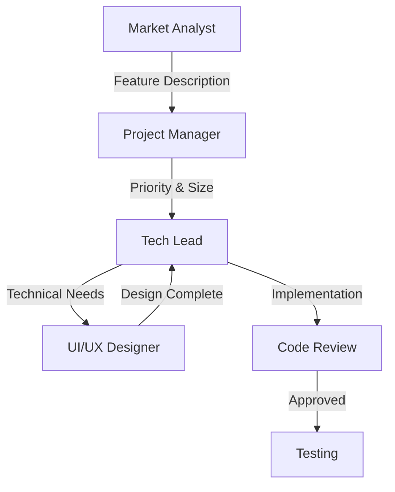

# Agent Workflows

Specialized workflows and instructions for each agent role.

## 🤖 Available Agents

### Development
- **[Tech Lead](./tech-lead-workflow.md)** - Technical architecture, code review, implementation

### Business & Analysis  
- **[Market Analyst](./market-analyst.md)** - Market research, user personas, business objectives

### Design
- **[UI/UX Designer](./ui-ux-designer.md)** - Design, user experience, accessibility

### Management
- **[Project Manager](./project-manager.md)** - Planning, coordination, prioritization
- **[Security Advisor](./security-advisor.md)** - Security analysis, vulnerability assessment

### Coordination
- **[Agent Coordination](./coordination.md)** - How agents work together

## 🔄 Standard Handoff Flow



## 📋 Quick Reference

### Tech Lead Responsibilities
- Create branch for EVERY issue
- Use `Related to #XXX` in PRs
- Follow naming conventions
- Regular progress updates

### Market Analyst Responsibilities  
- Feature descriptions with market context
- Business objectives and ROI
- User personas with demographics

### Project Manager Responsibilities
- Assign priority (P0-P3)
- Assign size (XS-XL)
- Coordinate handoffs
- Track milestones

## 🏷️ Handoff Template

```markdown
## 🔄 Handoff to @[Agent]

**Context**: [What has been done]
**Need**: [What is expected]
**Constraints**: [Any limitations]
**Artifacts**: [Links to relevant items]

/cc @[next-agent]
```

---

[← Back to Documentation](../)